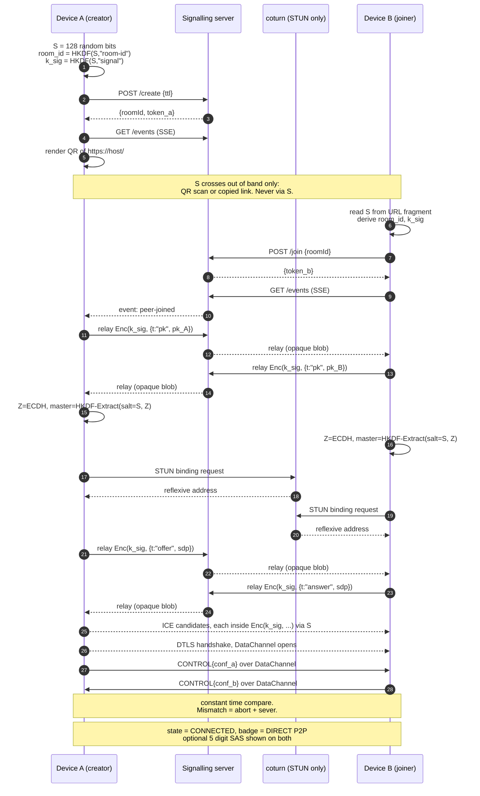
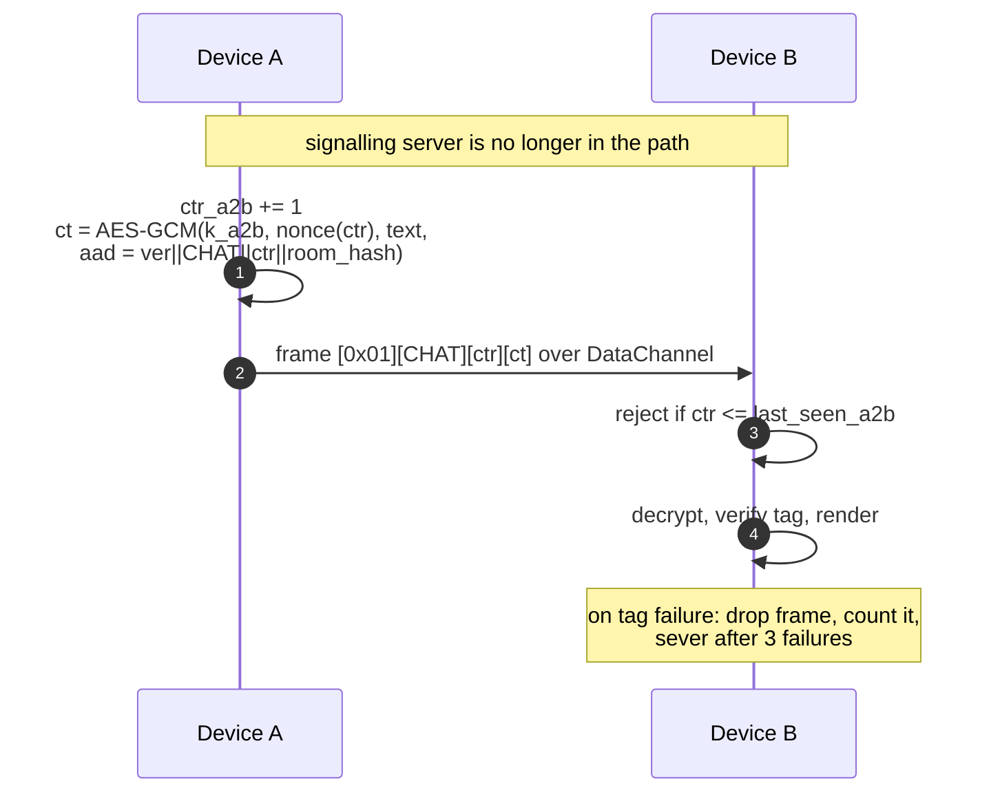
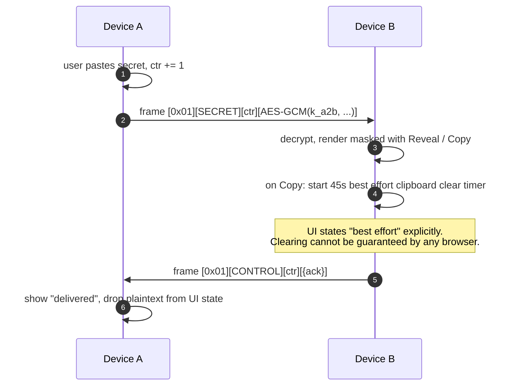
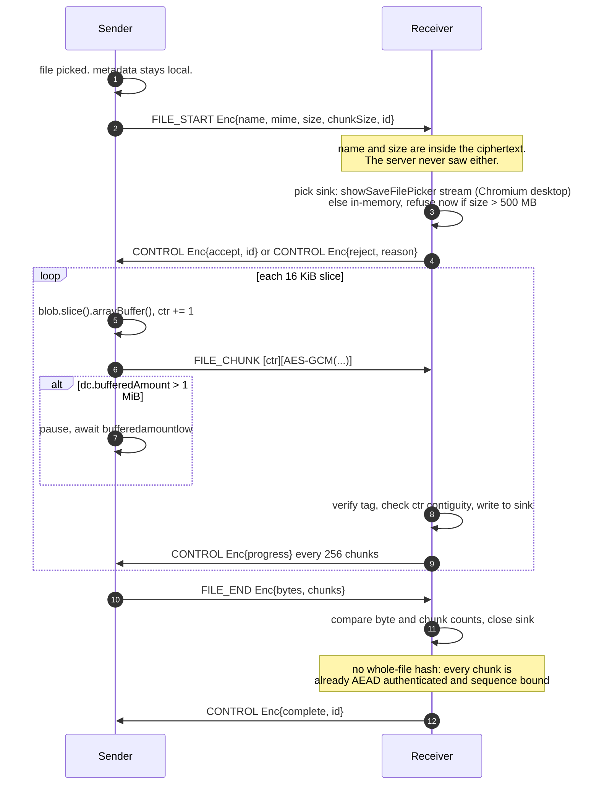

# Warp Gate: Architecture Review, Cryptographic Design, Threat Model

Status: design review. No implementation code written yet.
Date: 2026-08-08

## Decisions taken (2026-08-08)

| Decision | Choice | Consequence |
|---|---|---|
| Deploy host | Self-hosted container | Reuses an existing `cloudflared` tunnel and deploy tooling. Zero dependency app means the Dockerfile is a base image plus a copy, no build step, so no heavy build runs on the host. |
| Crypto stack | Web Crypto only | ECDH P-256, HKDF-SHA256, AES-256-GCM. No vendored WASM. Non extractable keys. Curve swappable to X25519 when WebKit ships it. |
| ICE posture | Self hosted STUN only | Spec faithful P2P only for v1. `config.js` holds the ICE server list as data so coturn TURN is a config change later, not a refactor. |
| Hostname | `wg.fysh.site` | Existing Cloudflare zone. Note the `wg` prefix reads as WireGuard to anyone who knows this deployment; accepted as the user's preference. |

**Prerequisite this creates:** self hosted STUN needs a publicly reachable UDP port forwarded to the host. Cloudflare Tunnel does not carry UDP, so STUN cannot go through it.

## What implementation changed (2026-08-08, after building it)

Four things were learned by measuring rather than reasoning, and each changed the design.

**coturn was dropped in favour of an in-process STUN responder.** UDP 3478 turned out to be unavailable: another service publishes it, but nothing listens behind that publish (verified by entering the container's network namespace, where the only UDP socket is Docker's embedded DNS). Rather than disturb another service, Warp Gate took 3479. At that point adding a whole coturn container for what is a stateless, non-cryptographic, fully specified request and response looked like exactly the overengineering section 21 forbids. `server/stun.js` is roughly 50 lines of RFC 5389 Binding handling, which keeps the deployment to the single process the specification asks for. It is verified against an independently written client, and that client is proved able to fail before its passes are trusted.

**The QR encoder was written rather than vendored.** `zbarimg` and `qrencode` are both present locally, which turns a hand written encoder from an act of faith into something checkable: every generated code is rendered to PNG and decoded by an unrelated implementation, at all six supported versions and at exactly their stated capacity. That evidence was not available for an unreviewed vendored blob, so writing it was the lower risk option, not the higher one.

**Self hosted STUN cannot be reached through Cloudflare, which makes public operation a real decision rather than a detail.** Cloudflare Tunnel is TCP only. Making STUN publicly reachable therefore needs a DNS-only record pointing at the home IP plus a UDP port forward, which publishes the home address permanently and to everyone. That is a broader exposure than the peer-to-peer IP disclosure in finding 1.3, and it is the user's call. The three options are set out in `deploy/NOTES.md`. Default remains no advertised STUN, which is same-network operation only.

**Docker-published ports on this host are unreachable over its overlay network, and this is pre-existing.** A packet capture shows a request arriving on the overlay interface, being DNAT'd, and then leaving via the host's VPN interface re-sourced to that VPN's address, so it never reaches the container and no reply exists. Published TCP ports on other containers fail the same way, so this is host routing behaviour affecting every container, not anything to do with Warp Gate. It is reported, not changed: altering that routing affects unrelated services and the VPN posture.

---

## 0. Verified platform facts

Everything below is checked against primary documentation or the local machine, not recalled.

| Fact | Finding | Source |
|---|---|---|
| RTCDataChannel max message size | No universal limit. `max-message-size` SDP attribute (RFC 8841) negotiates it; **default assumed 64 KiB when the attribute is absent**. Most modern browsers accept >= 256 KiB. MDN explicitly warns to keep messages "moderately small" to avoid head-of-line blocking. | MDN, Using data channels |
| Backpressure controls | `bufferedAmount` + `bufferedAmountLowThreshold` + `bufferedamountlow` event. Buffer size itself is not controllable. | MDN, RTCDataChannel |
| Cloudflare WebSocket proxying | Supported on all plans including free. **100 second idle timeout** on Free/Pro; only Enterprise can change it. Application-level heartbeat required. WAF inspects only the HTTP 101 upgrade. Argo Smart Routing is incompatible with WebSockets. | Cloudflare Network docs |
| `showSaveFilePicker` (streaming save to disk) | Chrome/Edge/Opera desktop only. **Firefox: no support, by deliberate policy. Safari (macOS, iOS, iPadOS): no support** for `showSaveFilePicker`/`showOpenFilePicker`/`showDirectoryPicker`; Origin Private File System only. | MDN + Chrome capabilities docs |
| WebCrypto X25519 | Shipped in Chrome (Blink) and Firefox (Gecko); Safari/WebKit in progress. Ed25519 still flagged in Chrome. **Not yet safe as a baseline.** | chromestatus, caniuse, Igalia |
| WebCrypto ECDH P-256 + HKDF + AES-GCM | Universal across every browser in scope for a decade. | Web Crypto API spec |
| Local toolchain | node v26.5.1, python 3.14.6, git 2.55. **No npm, no npx, no pnpm, no corepack, no bun, no deno, no go on this machine.** | local probe |
| Package manager policy | npm is not used here, on supply chain risk grounds. pnpm is used where a package manager is needed at all. | Project policy |
| Existing edge pattern | Cloudflare Tunnel in front of the origin, which means Cloudflare terminates TLS in this topology. | Cloudflare Tunnel docs |

The last two facts are load bearing: **Warp Gate must be a zero dependency project.** No bundler, no framework, no npm packages, plain ES modules served statically, Node standard library only on the server. This turns out to make the design better, not worse (see 3.1).

---

## 1. Contradictions and weaknesses in the specification

Fifteen findings, ordered by how much they change the design.

### 1.1 The spec conflates "relay" with "TURN". They are not the same threat.

Sections 1 and 12 forbid a relay. The stated reason is that the server must not carry payloads. But with application layer E2E encryption (section 4), a TURN server carries **ciphertext**, exactly like Cloudflare already does in the HTTP path. Banning TURN buys no confidentiality. What it costs is a hard connection failure for the network conditions that describe the primary use case: a phone on carrier NAT talking to a laptop behind a home router. Published measurements of WebRTC deployments consistently put the fraction of sessions that cannot connect without TURN in the 8 to 20 percent range, concentrated on exactly mobile and corporate networks.

Change: keep the file relay ban absolutely (server never sees plaintext, never stores bytes). Do not architect TURN out. Ship v1 P2P only as the spec asks, but build the ICE configuration as data so a self hosted coturn can be added later behind an explicit, visible `RELAYED (still encrypted)` badge. The UI must already distinguish direct from relayed, which section 11 requires anyway.

### 1.2 Using a public STUN server contradicts section 15.

P2P still needs STUN to learn the public reflexive address. Pointing at `stun.l.google.com` tells Google the client's IP and that the client uses this app, which is precisely the third party disclosure section 15 forbids. This is not optional plumbing: it is a privacy hole in the default path.

Change: run coturn in **STUN only mode** on the deployment host. It is roughly 10 MB resident and one UDP port. Self hosted STUN is a prerequisite for the privacy claim, not an enhancement.

### 1.3 WebRTC P2P inherently reveals each peer's IP address to the other peer. This contradicts the stated primary use case.

The brief says the primary use case is transferring between devices that are "identity separated". A direct WebRTC connection links those two endpoints at the IP layer, to each other. If the whole point is that identity A should not be linkable to identity B, and both endpoints sit on networks that identify their operator, then **direct P2P is the worst option and a relay is the better one**. This inverts the usual intuition and it is the single most important thing the onboarding must say.

Change: state it plainly in onboarding. Note that a future TURN mode with `iceTransportPolicy: "relay"` is the mode that hides peer IPs from each other, at the cost of the relay operator seeing both. Do not claim P2P is the private option; it is the option where no server sees the data.

### 1.4 SDP contains IP addresses, and the spec leaves signaling in the clear.

Section 4 encrypts chat and files. It says nothing about the signaling payload. But the SDP and ICE candidates **are** the peers' local and public IP addresses, and section 14 correctly notes Cloudflare sits in the HTTP path. As specified, Cloudflare and the signaling server see both peers' addresses in plaintext.

Change (addition to the spec): encrypt the entire signaling payload under a key derived from the pre shared room secret. The server relays opaque blobs and cannot parse SDP even in principle. This costs about forty lines and closes the largest metadata leak in the design.

### 1.5 Section 19's "optional human password" is a trap and should not ship.

A short spoken password mixed into a KDF is offline brute forceable by exactly the adversary section 19 names: someone who can observe the signaling channel. Only a PAKE fixes that. The CFRG selected balanced PAKE is CPace (RFC 9383). There is no vetted browser CPace implementation obtainable under the no-npm constraint, and hand implementing it would violate "do not invent cryptography" in spirit.

Change: do not ship a human password. Ship a **128 bit secret carried in the URL fragment**, which the QR code and the copy-link button deliver for free and which the browser never sends to the server. Add an optional **5 digit Short Authentication String** derived from the handshake transcript that both users can read aloud to detect a MITM. This is strictly stronger than a spoken password, requires no new primitives, and satisfies the "say it aloud" use case better. If a spoken-only channel is genuinely needed later, add CPace with a reviewed implementation. Never a single-hashed password.

### 1.6 Short room TTL breaks the WiFi to LTE transition the spec asks us to test.

Section 5 wants the room destroyed quickly. Section 20 wants WiFi to LTE transitions to work. A network change requires an ICE restart, which requires the signaling channel. If the room is gone, the session dies with the first network change.

Change: two TTLs. **Unclaimed TTL** (waiting for a peer): 5 minutes default, short and aggressive. **Session TTL** (once paired): the user chosen 10/30/60 minutes, during which the signaling channel stays open for renegotiation. The room still holds nothing but two socket references and an expiry.

### 1.7 "Two or more devices" contradicts everything else in the document.

The intro says two or more. Every other section, the key schedule, the UI and the state machine assume two. Mesh multiplies key management, fanout, and failure modes.

Change: v1 is exactly two peers. The room locks on the second join.

### 1.8 VPN/proxy detection (section 16) must be deleted, not softened.

Any such check requires calling a third party IP intelligence API from the user's browser. That leaks the user's IP to that third party and creates exactly the telemetry section 15 bans. Softening the wording to "inconclusive" does not fix the leak.

Change: remove the feature. Replace with one static sentence in onboarding: "Warp Gate does not hide your network address. Both devices learn each other's IP address when they connect directly."

### 1.9 File size is a hard ceiling on non Chromium browsers, and it is a user facing limit.

Verified above: `showSaveFilePicker` does not exist in Firefox or in any Safari. Without it the receiver must assemble the whole file as a Blob in memory. iOS Safari will kill the tab on a multi gigabyte Blob.

Change: feature detect. Where the File System Access API exists (Chromium desktop), stream chunks straight to disk with no ceiling. Everywhere else, assemble in memory with a **documented cap, 500 MB to start**, and refuse the transfer up front with a clear message rather than failing at 90 percent. A Service Worker streaming download would lift the cap but installs a persistent Service Worker, which sits badly with "leave nothing behind"; deferred, not adopted.

### 1.10 Cloudflare Tunnel means Cloudflare terminates TLS. Say so.

The existing pattern here is Cloudflare Tunnel, which decrypts and re-encrypts. Grey-cloud DNS-only avoids that but exposes the home IP address and requires an open inbound port and self managed certificates.

Recommendation: keep Cloudflare Tunnel (no open ports, home IP hidden) and accept that Cloudflare sees metadata: client IPs, timing, room IDs, session duration. With 1.4 in place it sees nothing else. Document that list exactly. Note the verified 100 second idle timeout: the signaling channel needs a 25 second heartbeat regardless of transport.

### 1.11 "Destroy cryptographic material where practical" is unachievable in JavaScript, unless you pick the right API.

You cannot zeroize a JS `Uint8Array` reliably; the engine may have copied it. libsodium-wrappers holds keys in a WASM heap array you must remember to `memzero`, and any JS copy lingers.

WebCrypto non extractable `CryptoKey` objects never expose key bytes to the JS heap at all. Dropping the reference makes the material unrecoverable from page memory. This is a materially stronger property than the libsodium path, and it combines with the no-npm constraint to make the choice easy. See 3.1.

### 1.12 Rate limiting (section 13) and no IP logs (section 15) need explicit reconciliation.

Change: in memory token buckets keyed by `HMAC-SHA256(process_random_salt, client_ip)` truncated to 8 bytes. The salt is generated at boot and never persisted, so buckets are meaningless after a restart and unlinkable to an IP without the salt. Nothing is written to disk. Additionally, HTTP access logging must be off at the origin **and** `cloudflared` must be checked for its own request logging.

### 1.13 A room-code guess is a denial of service, and the spec has no handling for it.

With the secret in the fragment, an attacker who guesses a room ID cannot decrypt anything, but they can occupy the second slot so the legitimate peer cannot join. The design must handle it: a peer that fails key confirmation is evicted, the slot is freed, and the creator sees "a device tried to join and failed verification".

### 1.14 The whole-file hash in FILE_END is cargo cult and should be dropped.

Once every chunk is individually AEAD authenticated under a key only the two peers hold, and the chunk sequence number is bound into the AEAD associated data, a whole-file hash adds no cryptographic property. It only adds a streaming digest problem, since WebCrypto has no incremental `digest`.

Change: `FILE_END` carries plaintext byte count and chunk count for reassembly sanity. Drop the hash as a security control. Optionally display a SHA-256 of the assembled file for the user's own out of band comparison, clearly labelled as a convenience, not a check.

### 1.15 "One shot mode" cannot be enforced by the server.

"Destroy on transfer complete" is a peer asserted event the server cannot verify. It is a client side UX affordance. Label it as such; do not present it as a security control.

---

## 2. Component architecture and trust boundaries

```
                        TRUST BOUNDARY 1
   Device A             (network + operators)              Device B
  +-----------+                                          +-----------+
  | Browser   |                                          | Browser   |
  | - keys    |                                          | - keys    |
  | - plain-  |                                          | - plain-  |
  |   text    |                                          |   text    |
  +-----+-----+                                          +-----+-----+
        |                                                      |
        |  (1) signalling: opaque ciphertext over HTTPS        |
        |                                                      |
        v                                                      v
   +---------------------------------------------------------------+
   |  Cloudflare edge  (sees: IPs, timing, room ID, sizes)          |
   +-------------------------------+-------------------------------+
                                   |  Cloudflare Tunnel
                                   v
   +---------------------------------------------------------------+
   |  warp-gate signalling process (Node, stdlib only)              |
   |    Map<roomId, {a, b, expiresAt}>   <- entire persistent state |
   |    no disk, no logs, no db, dies on restart                    |
   +---------------------------------------------------------------+
                                   |
   +---------------------------------------------------------------+
   |  coturn, STUN only (self hosted)  sees: IP + a binding request |
   +---------------------------------------------------------------+

        (2) WebRTC DataChannel, DTLS transport
        A <=====================================================> B
              inner payload additionally AES-256-GCM encrypted
              under keys derived from ECDH + the URL fragment secret

                        TRUST BOUNDARY 2
   The fragment secret never crosses boundary 1. It travels
   only via the QR code or a copy-pasted link, out of band.
```

Trust boundaries, stated precisely:

- **Inside the boundary:** the two browser tabs. They hold plaintext and keys. Compromise here defeats everything and is explicitly out of scope.
- **Outside, semi-trusted for availability only:** the signaling process. It can deny service, can refuse to relay, can lie about peer presence. It cannot read, cannot MITM without the fragment secret, cannot store.
- **Outside, untrusted:** Cloudflare, the coturn host's network, every intermediate network. All see metadata only.
- **The fragment secret is the boundary.** Everything the design claims rests on that value reaching the second device without passing through the signaling path.

---

## 3. Cryptographic design

Nothing here is novel. The construction is a pre-shared-key-authenticated ephemeral Diffie-Hellman with explicit key confirmation: the same shape as TLS 1.3 `psk_dhe_ke` and the Noise `NNpsk0` pattern, built from Web Crypto primitives only.

### 3.1 Primitive selection: Web Crypto, not libsodium

The brief suggests XChaCha20-Poly1305 and libsodium secretstream. Recommend against, for four concrete reasons:

1. **No package manager.** npm is blacklisted; pnpm is not on this machine. Adopting libsodium means vendoring a ~200 KB WASM blob by hand and taking responsibility for its provenance forever. That is a larger supply chain exposure than using the browser's own audited implementation.
2. **Key hygiene is strictly better with WebCrypto** (see 1.11): non extractable `CryptoKey` keeps key bytes out of the JS heap entirely, which is the only version of "destroy cryptographic material" (section 17 item 4) that is actually true.
3. **AES-256-GCM is hardware accelerated** on every device in scope. ChaCha20's advantage is on hardware without AES-NI, which is not the target.
4. **Nonce reuse, the real reason to want XChaCha20's 192 bit nonce, is designed out here.** Keys are per session and per direction, and the nonce embeds a strictly increasing 64 bit counter. There is no scenario in this protocol where a `(key, nonce)` pair repeats.

Primitives used: `ECDH P-256`, `HKDF-SHA256`, `AES-256-GCM`, `SHA-256`, `crypto.getRandomValues`. All universally supported, all in the Web Crypto spec. X25519 is preferable in principle but is not yet a safe baseline (verified in section 0); the key schedule is written so the curve can be swapped when WebKit ships.

### 3.2 The room secret

```
S            = 128 random bits from crypto.getRandomValues
displayed as = Crockford base32, 26 chars, grouped WARP-XXXX-XXXX-XXXX-XXXX-XXXX-XX
carried in   = https://<host>/#<26 chars>          the fragment is never sent in an HTTP request
room_id      = base32( HKDF-SHA256(S, info="wg/v1/room-id")[0..5] )   40 bits, server visible
```

Deriving `room_id` from `S` means the link is one field, and the server's view of the room ID reveals nothing about `S` (HKDF is one way).

Why 128 bits and not something typable: `S` protects two different things with two different entropy requirements, and this is worth stating because it is the crux of section 19.

- Against an **active MITM**, `S` only needs to survive a single real time online guess, because a failed guess is detected by key confirmation and the room is destroyed. Roughly 40 bits would do.
- Against a **passive observer who records the signaling traffic**, `S` must survive an **offline** attack, because `S` also encrypts the SDP and ICE candidates (finding 1.4). Recovering `S` later reveals the peers' IP addresses. That requires 128 bits.

Because the session key comes from ephemeral ECDH, recovering `S` after the fact never reveals chat or file content: the data path has forward secrecy independent of `S`.

### 3.3 Handshake

Creator is A, joiner is B. Both already hold `S`.

```
k_sig  = HKDF-SHA256(ikm=S, salt="", info="wg/v1/signal")        AES-256-GCM key

  every signalling payload in both directions:
  envelope = { n: random_96_bit_nonce, c: AES-GCM(k_sig, n, json, aad="wg/v1"||room_id) }
  the server sees only { n, c }

A, B each: (sk, pk) = ECDH P-256 keypair, generateKey(..., extractable=false, ["deriveBits"])
A -> B : pk_A          (inside the encrypted envelope)
B -> A : pk_B          (inside the encrypted envelope)

Z      = ECDH(sk_self, pk_peer)                                   256 bits, deriveBits
T      = SHA-256( "wg/v1" || room_id || pk_A || pk_B )            canonical order: creator first
master = HKDF-Extract( salt = S, ikm = Z )                        the PSK enters as the HKDF salt

k_a2b    = HKDF-Expand(master, "wg/v1/data/a2b" || T, 32)          non extractable AES-GCM key
k_b2a    = HKDF-Expand(master, "wg/v1/data/b2a" || T, 32)          non extractable AES-GCM key
conf_a   = HKDF-Expand(master, "wg/v1/conf/a"   || T, 32)
conf_b   = HKDF-Expand(master, "wg/v1/conf/b"   || T, 32)
sas      = HKDF-Expand(master, "wg/v1/sas"      || T,  8) -> 5 decimal digits
```

Then over the established DataChannel, before any application data:

```
A -> B : CONTROL{ confirm: conf_a }
B -> A : CONTROL{ confirm: conf_b }
each side compares in constant time; mismatch or timeout (5s) => abort, sever, warn
```

Properties this gives:

- An attacker without `S` cannot MITM: they cannot produce a valid `conf`, because `master` mixes `S`.
- An attacker without `S` cannot read signaling: SDP and ICE candidates are under `k_sig`.
- Compromise of `S` later does not decrypt recorded data: `master` also requires the ephemeral ECDH secret, which is destroyed with the tab. Forward secrecy.
- Wrong secret produces an immediate, explicit, understandable failure, not silent garbage.
- `T` binds both public keys and the room, so transcripts cannot be spliced across sessions.

The 5 digit SAS is optional belt and braces: `S` already authenticates. It exists for the user who wants to confirm aloud that no substitution happened.

### 3.4 Data channel framing

One binary frame per message. Header is cleartext (routing), everything meaningful is inside the ciphertext.

```
offset 0   1 byte    version = 0x01
offset 1   1 byte    type
offset 2   8 bytes   counter, uint64 big endian, per direction, strictly increasing
offset 10  N bytes   AES-256-GCM ciphertext + 16 byte tag

nonce = 4 byte per-direction constant || 8 byte counter        cannot repeat: key is per direction
aad   = version || type || counter || room_id_hash

types: 0x01 CHAT   0x02 SECRET   0x10 FILE_START   0x11 FILE_CHUNK
       0x12 FILE_END   0x20 CONTROL
```

Receiver rejects any frame whose counter is less than or equal to the last accepted counter for that direction: replay and reorder both die there. The DataChannel is ordered and reliable, so strict monotonicity holds. `type` is inside the AAD, so a file chunk cannot be replayed as a chat message: that is section 3's framing requirement enforced cryptographically rather than by convention.

**File metadata (name, MIME type, size) lives inside the FILE_START ciphertext.** It never appears in a header and never reaches the server. That satisfies section 8's metadata requirement, which a naive implementation would violate by putting the filename in a JSON header.

### 3.5 Chunking and backpressure

- Plaintext chunk: **16 KiB**. With a 16 byte GCM tag and a 10 byte header this is 16410 bytes on the wire, comfortably below the 64 KiB figure browsers assume when `max-message-size` is absent (verified, section 0), and below every browser's real limit.
- Sender reads with `blob.slice(off, off+16384).arrayBuffer()`, so a 4 GB file is never resident in sender memory.
- `dc.bufferedAmountLowThreshold = 262144`. Pause when `dc.bufferedAmount > 1048576`, resume on the `bufferedamountlow` event. No unbounded `send()` loop.
- Receiver sink is chosen at FILE_START: `showSaveFilePicker` stream where available (no ceiling), otherwise in-memory chunks with the documented 500 MB cap enforced **before** the transfer starts.

---

## 4. Signaling protocol

### 4.1 Transport, and a wire test before committing

The no-dependency constraint rules out `ws`. Two viable stdlib options:

| | Server-Sent Events + POST | Hand rolled RFC 6455 WebSocket |
|---|---|---|
| Code | ~30 lines, `EventSource` handles reconnect natively | ~180 lines of frame parsing: masking, fragmentation, control frames |
| Risk | Cloudflare may buffer `text/event-stream` in some configurations | Parser is security sensitive code written by hand |
| Connections | Two (one SSE + POSTs) | One |

Recommendation: **SSE + POST**, because writing a WebSocket frame parser by hand is more risk than this project should take on. But per the brief's instruction to verify actual deployment behaviour rather than assume: **Phase 0 is a wire test of SSE through the real Cloudflare Tunnel** (`curl -N`, confirm events arrive unbuffered and the connection survives a 25 second heartbeat past the verified 100 second idle timeout). If Cloudflare buffers, fall back to the WebSocket implementation. This decision is data, not opinion.

### 4.2 Messages

Client to server:

```
POST /api/create   { ttlMinutes }              -> { roomId, expiresAt }
POST /api/join     { roomId }                  -> { role: "b" } | 404 | 409 full
POST /api/relay    { roomId, token, envelope } -> 204        envelope is opaque {n,c}
POST /api/bye      { roomId, token }           -> 204
GET  /api/events?roomId=..&token=..            -> text/event-stream
```

Server to client, as SSE events:

```
event: peer-joined      data: {}
event: relay            data: { n, c }         verbatim, never inspected
event: peer-left        data: { reason }
event: closed           data: { reason: "ttl" | "severed" | "shutdown" }
: heartbeat comment every 25s                  under the verified 100s Cloudflare idle timeout
```

`token` is a 128 bit per-participant capability minted at create/join. It prevents a third party who guesses a room ID from posting into or reading the room. It is bearer only, never persisted.

The server has exactly one rule about `envelope`: relay it to the other slot unmodified. It does not parse it, cannot parse it, and does not know it contains SDP.

### 4.3 Server state, complete

```js
rooms: Map<roomId, {
  a: { token, res } | null,     // res = the live SSE response object
  b: { token, res } | null,
  createdAt, expiresAt, timer
}>
```

That is the entirety of persistent state. No database, no file writes, no logs. A restart destroys every room, as section 5 requires. A sweeper runs every 10 seconds; a room is deleted when both slots are empty or the expiry fires. Rooms lock at two participants.

Two TTLs per finding 1.6: unclaimed 5 minutes, paired 10/30/60 minutes user selected.

### 4.4 Abuse limits

In memory token buckets keyed by `HMAC-SHA256(boot_salt, ip)[0..8]`, no persistence, no logging:

```
create   10 per 5 min per key      relay   200 per min per room
join     30 per 5 min per key      body    64 KiB max per relay
rooms    200 concurrent, global    SSE     2 concurrent per key
```

---

## 5. Threat model

### 5.1 Defended against

| Threat | Mechanism | Residual |
|---|---|---|
| Server operator reads chat or files | Payload is AES-256-GCM under keys from ECDH + a fragment secret the server never receives | None, given the fragment secret was delivered out of band |
| Server compromise exposes plaintext | Server holds no plaintext and no keys, ever | None |
| Server or Cloudflare learns peer IP addresses from SDP | Signaling payloads encrypted under `k_sig` (finding 1.4) | Cloudflare still sees the two client IPs from the HTTP connections themselves |
| Active MITM at the signaling layer | PSK-authenticated ECDH plus mandatory explicit key confirmation; MITM cannot forge `conf` without `S` | Attacker who obtains `S` (shoulder surfs the QR, reads the link) is not an MITM, they are a participant |
| Passive recording of signaling for later decryption | Forward secrecy: `master` needs the ephemeral ECDH secret, destroyed with the tab | None for data. Recovering `S` offline would reveal recorded ICE candidates, hence 128 bits |
| Tampering with encrypted payloads | AEAD; any modified byte fails authentication and the frame is dropped | None |
| Replay, in-session | Strictly increasing per-direction counter in the nonce and the AAD | None |
| Replay, cross-session | Keys are ephemeral per session; transcript hash `T` binds room and both public keys | None |
| Type confusion (file chunk injected as chat) | Message type is authenticated in the AAD | None |
| Room guessing to read content | Guessing `room_id` yields nothing without `S`; key confirmation fails | Guessing is a denial of service, see below |
| Unauthorized room joining | Room locks at two; per-participant capability token; failed confirmation evicts and warns | |
| Persistent server-side storage | There is no storage layer to misconfigure | |
| Session reuse after expiry | Dual TTL plus sweeper plus room deletion on restart | |

### 5.2 Explicitly NOT defended against

Stated plainly, in the product, not just here.

- A compromised sender or receiver device, browser, or extension.
- Screenshots, photographs of the screen, or a recipient who saves and forwards.
- Malware or a keylogger on either endpoint.
- A malicious participant. Anyone holding the link is a legitimate participant by construction.
- Global passive traffic analysis. Warp Gate does not pad, delay, or cover traffic.
- **Peer IP address disclosure between the two peers.** Direct P2P reveals each peer's address to the other. This is inherent, and it is the property most at odds with the "identity separated" use case (finding 1.3).
- Cloudflare metadata: client IPs, timing, room IDs, byte counts, session duration.
- Browser memory hygiene. The OS may page tab memory to disk. Nothing in a browser can promise otherwise.
- Clipboard clearing. Best effort only, and impossible to guarantee across operating systems and browsers, as the brief already recognises.
- Anonymity. Warp Gate is confidential, not anonymous.

---

## 6. Protocol state machine

```
      IDLE
        |  create / join
        v
   CREATING ---------> WAITING_FOR_PEER ----(unclaimed TTL 5m)----> EXPIRED
        |                     | peer-joined
        |                     v
        |               EXCHANGING_KEYS   (pk_A, pk_B over encrypted signalling)
        |                     |
        |                     v
        |                NEGOTIATING      (SDP offer/answer, ICE, all encrypted)
        |                     |
        |                     v
        |               CONNECTING        (DataChannel opening)
        |                     |
        |                     v
        |                CONFIRMING       (conf_a / conf_b exchange, 5s timeout)
        |                  |       |
        |            match |       | mismatch or timeout
        |                  v       v
        |             CONNECTED   AUTH_FAILED --> SEVERED (peer evicted, slot freed,
        |                  |                               creator warned)
        |                  | sever / peer-left / session TTL / network loss
        |                  v
        +------------> SEVERED --> TERMINAL   (no reconnection from this state)
```

`CONNECTED` also has an internal `RECONNECTING` excursion for ICE restart on a network change, which is why the signaling channel stays open for the session TTL (finding 1.6).

---

## 7. Sequence diagrams

### 7.1 Pairing and handshake



### 7.2 Chat



### 7.3 Secret transfer



### 7.4 File transfer



### 7.5 Room destruction

```mermaid
sequenceDiagram
    autonumber
    participant A as Device A
    participant S as Signalling server
    participant B as Device B
    A->>A: user presses SEVER WARP GATE
    A->>B: CONTROL Enc{sever} over DataChannel
    A->>A: dc.close(); pc.close()
    A->>A: drop all CryptoKey refs (non extractable:<br/>bytes were never in the JS heap)
    A->>A: clear message list, file buffers, S, room_id, token
    A->>A: history.replaceState to strip the fragment from the URL
    A->>S: POST /bye {roomId, token}
    S->>S: rooms.delete(roomId); close both SSE responses
    S-->>B: event: closed {reason:"severed"}
    B->>B: same teardown, state = TERMINAL
    Note over A,B: "Warp Gate severed. The session has ended."<br/>Reconnect is impossible: keys gone, room gone,<br/>fragment stripped, state machine terminal.
    Note over S: TTL path is identical minus the CONTROL frame:<br/>sweeper deletes the room and emits closed{reason:"ttl"}
```

---

## 8. Data lifecycle

| Datum | Created | Lives in | Destroyed | Ever on disk? |
|---|---|---|---|---|
| `S` (room secret) | Creator's browser, `getRandomValues` | JS variable + URL fragment + QR pixels | Sever, tab close, or `replaceState` strip | Only if the user saves the QR or bookmarks the link |
| `room_id` | Derived from `S` | Server `Map` key, both clients | Room deletion | No |
| Participant token | Server, per join | Server `Map`, client memory | Room deletion | No |
| ECDH private key | Browser, non extractable | Browser key store, outside the JS heap | Reference dropped on sever | No |
| `k_sig`, `k_a2b`, `k_b2a` | Derived at handshake | Non extractable `CryptoKey` | Reference dropped on sever | No |
| Chat messages | Peer devices | DOM + JS array | Sever, refresh, tab close | No, unless the OS pages the tab |
| File plaintext, sender | User's disk already | Read 16 KiB at a time | Immediately after each chunk | It is the user's own file |
| File plaintext, receiver | Reassembled | Stream to disk if the user picked a location, else memory | Explicit save or discard on sever | Only where the user chose to save |
| Signaling envelopes | Both clients | Server RAM, in flight only | Immediately after relay, never queued | No |
| Rate limit buckets | Server | RAM, salted HMAC of IP | Window expiry, boot salt is not persisted | No |
| IP addresses | The network | Cloudflare and kernel sockets | Origin access logs disabled; Cloudflare retains per its own policy | Not at the origin |

---

## 9. Recommended changes to the specification, consolidated

| # | Change | Reason |
|---|---|---|
| 1 | Encrypt signaling payloads under a key derived from `S` | SDP and ICE candidates are IP addresses; the spec leaked them to the server and Cloudflare (1.4) |
| 2 | Drop the optional human password. Ship a 128 bit fragment secret plus an optional 5 digit SAS | A single-hashed spoken password is offline attackable by the exact adversary section 19 names; no vetted browser PAKE is obtainable under the no-npm rule (1.5) |
| 3 | Web Crypto (ECDH P-256, HKDF, AES-256-GCM) instead of libsodium XChaCha20 | Zero dependencies under the npm blacklist, plus non extractable keys make section 17's "destroy key material" actually true (1.11, 3.1) |
| 4 | Self host STUN. Never use a public STUN server | A public STUN server is a third party IP disclosure on the default path, contradicting section 15 (1.2) |
| 5 | Keep TURN out of v1 but not out of the architecture. ICE config is data | Banning TURN buys no confidentiality once payloads are E2E encrypted, and costs 8 to 20 percent of connections on exactly the mobile networks that are the primary use case (1.1) |
| 6 | Two TTLs: 5 minutes unclaimed, 10/30/60 minutes paired | A short room TTL breaks the WiFi to LTE ICE restart the spec asks us to test (1.6) |
| 7 | Exactly two peers in v1 | The intro's "two or more" contradicts the rest of the document (1.7) |
| 8 | Delete VPN/proxy detection entirely | Any implementation leaks the user's IP to a third party API, which is the telemetry section 15 forbids (1.8) |
| 9 | Document, prominently, that peers learn each other's IP address | Directly at odds with the "identity separated devices" use case, and currently unstated (1.3) |
| 10 | Drop the whole-file hash from FILE_END | Redundant once every chunk is AEAD authenticated and sequence bound; WebCrypto has no streaming digest anyway (1.14) |
| 11 | Per-participant capability tokens, and evict on failed key confirmation | Otherwise a room ID guess wedges the room as a denial of service (1.13) |
| 12 | Feature detect the file sink; cap at 500 MB where `showSaveFilePicker` is absent, and refuse up front | Verified: no Firefox and no Safari support. iOS will OOM on a large Blob (1.9) |
| 13 | Cloudflare Tunnel, with the metadata it sees enumerated in the docs; 25 second heartbeat | Verified 100 second idle timeout on Free/Pro; grey cloud would expose the home IP (1.10) |
| 14 | Label one-shot mode as a UX affordance, not a security control | The server cannot verify "transfer complete" (1.15) |
| 15 | Rate limit on salted HMAC of IP, in memory, boot salt never persisted | Reconciles section 13 with section 15 (1.12) |

---

## 10. Implementation plan

Zero dependencies. No build step. Plain ES modules served as static files. Node standard library only.

```
~/projects/warp-gate/
  DESIGN.md                    this document
  THREAT-MODEL.md              section 5, extracted for the site's /about page
  README.md
  server/
    index.js                   node:http, static serving, route table, graceful shutdown
    rooms.js                   the Map, dual TTL, sweeper, capacity and locking
    signal.js                  create / join / relay / bye / SSE events
    limits.js                  salted HMAC token buckets
    config.js                  port, TTLs, caps, ICE server list as data
  public/
    index.html                 single page, no framework
    css/style.css
    js/app.js                  UI state machine, onboarding, sever
    js/crypto.js               HKDF, ECDH, AEAD framing, counters, SAS
    js/signal.js               EventSource client, envelope encrypt and decrypt
    js/peer.js                 RTCPeerConnection, DataChannel, backpressure, ICE restart
    js/transfer.js             chunking, sink selection, progress, caps
    js/qr.js                   vendored single file QR encoder, reviewed and pinned
  deploy/
    warp-gate.service          systemd unit, hardened
    coturn.conf                STUN only
    NOTES.md                   Cloudflare Tunnel config, log disabling checklist
```

### Phases

**Phase 0: wire verification (before any application code).**
Stand up a 30 line SSE echo behind the real Cloudflare Tunnel. Verify with `curl -N` that events arrive unbuffered, that a 25 second heartbeat holds the connection past the verified 100 second idle timeout, and that no intermediary coalesces events. This decides SSE versus a hand rolled WebSocket. The brief says verify deployment behaviour rather than assume, and this is the assumption most likely to be wrong.

**Phase 1: minimal prototype.** Create room, join room, unencrypted signaling, WebRTC handshake, DataChannel opens, send the literal string "hello". No UI polish. Success criterion: two browsers on two machines, "hello" arrives, `chrome://webrtc-internals` confirms the selected candidate pair is host or srflx, not relay.

**Phase 2: cryptography.** `crypto.js` with the full key schedule, signaling envelope encryption, the framed AEAD data path, key confirmation, SAS. Test vectors checked against an independent Node implementation of the same schedule. Deliberate wrong-secret test must produce `AUTH_FAILED`, not garbage.

**Phase 3: encrypted chat.** The frame path end to end plus counter enforcement and the drop-on-tag-failure policy.

**Phase 4: secret mode.** Paste, send, masked render, reveal, copy, best effort clipboard timer with honest labelling.

**Phase 5: file transfer.** Chunking, backpressure, sink selection and feature detection, the pre-flight size cap, progress, cancel.

**Phase 6: QR pairing.** Sender renders the QR. **No QR scanner is needed in the app:** the receiver's native camera app opens the URL, which removes an entire dependency and an entire permission prompt.

**Phase 7: TTL, severing, onboarding.** Both TTL paths, the full sever sequence including fragment stripping, first run security onboarding with the corrected claims from section 5.2.

**Phase 8: hardening.** Every item on the brief's section 20 test list, plus: wrong secret, room ID guess, oversized relay body, malformed envelope, replayed frame, counter rollback, tag corruption, simultaneous join race, double join, refresh mid transfer, tab close mid transfer, two devices behind the same NAT, WiFi to LTE with ICE restart, and a deliberate P2P failure to confirm the failure message is the honest one from section 12.

**Phase 9: deploy.** systemd unit, coturn STUN only, Cloudflare Tunnel, and an explicit verification that access logging is off at the origin **and** in `cloudflared`.

### Test strategy

- Crypto: known answer vectors for the key schedule, run in Node against the browser implementation.
- Protocol: a headless Node peer using `node:crypto` that speaks the same frame format, so the data path is testable without two browsers.
- Server: direct `curl` against every route including the abuse paths, with non truncating assertions.
- Connectivity: real devices on real networks. Laptop plus phone on LTE is the meaningful test and cannot be simulated.

### Risks

| Risk | Mitigation |
|---|---|
| Cloudflare buffers SSE | Phase 0 wire test decides this before any application code depends on it |
| P2P fails on carrier NAT | Expected for a fraction of sessions. Honest failure message in v1; ICE config is data so coturn TURN is a config change, not a refactor |
| Vendored QR encoder is a supply chain item | Single file, read in full before vendoring, pinned with a recorded SHA-256, no transitive dependencies |
| Hand written crypto glue has a bug | The primitives are all browser native. The glue is a key schedule and a framing format, both fully specified above and covered by test vectors. Recommend an independent review of `crypto.js` before public exposure, per the brief |
| Node 26 without a package manager blocks a future need | The design has no dependency the standard library cannot satisfy. If that changes, build elsewhere with pnpm and copy the artifact |

---

## 11. Confidence assessment

| Dimension | Score | Note |
|---|---|---|
| Scope clarity | 18/20 | Greenfield, file layout fully determined. Deploy host still open. |
| Pattern familiarity | 17/20 | WebRTC, WebCrypto and SSE are all standard. The Cloudflare Tunnel pattern is already in use here. |
| Dependency awareness | 17/20 | Zero dependency constraint confirmed by probe. Cloudflare and browser limits verified against primary docs. |
| Edge cases | 18/20 | NAT traversal, mobile memory ceilings, the Cloudflare idle timeout and the Safari/Firefox file sink gap are all identified with concrete numbers. |
| Test strategy | 15/20 | Everything is testable except real network diversity, which needs actual devices on actual carrier networks. |
| **Total** | **85/100** | Above the 70 threshold. Ready to plan. |
