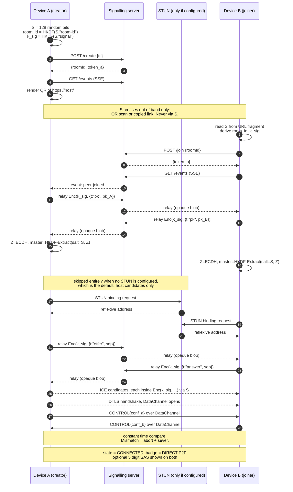
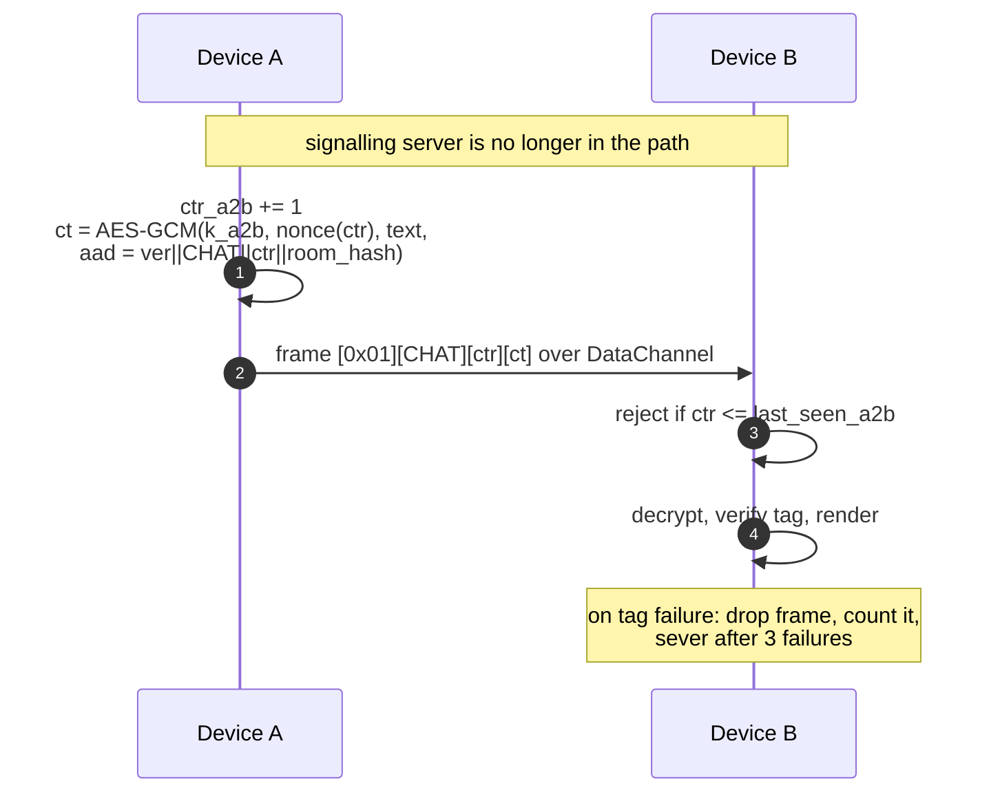
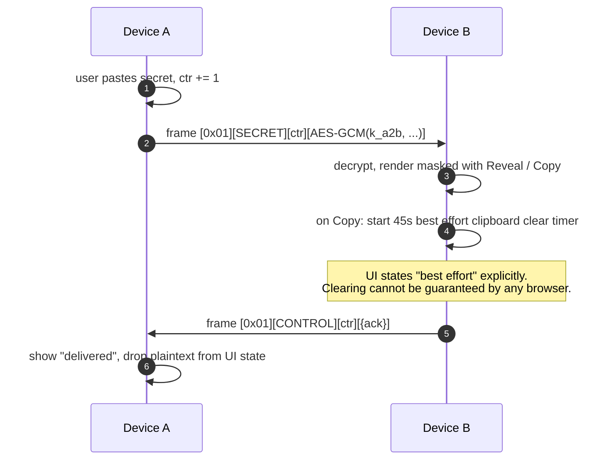
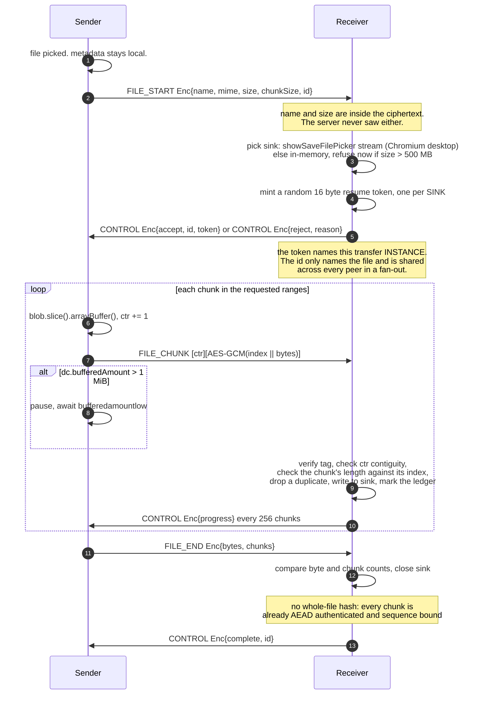
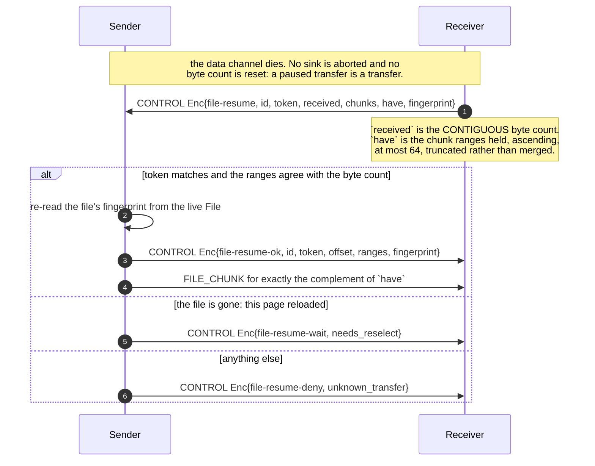

# Warp Gate: Architecture Review, Cryptographic Design, Threat Model

Status: **built and deployed.** This began as a design review written before any code
existed. It is now maintained as the record of the design and of where building it
changed the design. Where a decision was reversed by something measured, the original
reasoning is kept and the reversal is marked, because a design document that quietly
rewrites its own conclusions is not evidence of anything.

Date: 2026-08-08, maintained since (last audit against the code: 2026-08-09). Live at
`https://warpgate.fysh.site`. Deployment guidance is in
[deploy/SELF-HOSTING.md](deploy/SELF-HOSTING.md); the authors' own deployment log is not
published, because it is specific to their machines. The user-facing honest version of
section 5 is in [THREAT-MODEL.md](THREAT-MODEL.md).

## Decisions taken (2026-08-08)

| Decision | Choice | Consequence |
|---|---|---|
| Deploy host | Self-hosted container | Reuses an existing `cloudflared` tunnel and deploy tooling. Zero dependency app means there is no image build at all: a stock `node:22-alpine` with the source mounted read-only, so no heavy build runs on the host. |
| Crypto stack | Web Crypto only | ECDH P-256, HKDF-SHA256, AES-256-GCM. No vendored WASM. Non extractable keys. Curve swappable to X25519 when WebKit ships it. |
| ICE posture | **Reversed during the build.** Now: no STUN by default, and `stun.cloudflare.com` in the deployed configuration. Originally: self hosted STUN only | See finding 1.2, which was reversed by what deployment actually required. `config.js` still holds the ICE server list as data, so adding TURN later is a config change, not a refactor. |
| Hostname | `warpgate.fysh.site` | Existing Cloudflare zone. Originally `wg.fysh.site`, which read as WireGuard; renamed on 2026-08-09. `wg.fysh.site` remains live and redirects here, because issued links and QR codes carry it. |

## What implementation changed (2026-08-08, after building it)

These were learned by measuring rather than reasoning, and each changed the design. The
first two together **reverse finding 1.2**, which is the largest single change in this
document.

**The gate code became eight words (2026-08-09).** 26 Crockford base32 symbols were
unusable on a phone keyboard. Eight words from a fixed 7776-word list is 103.40 bits, and
PBKDF2-HMAC-SHA256 at 600,000 iterations between the code and `S` puts the offline search
at 2^123.6 SHA-256 compressions, the same order the 128-bit code held. The list is bundled,
constant, and derived offline from the English spell file Vim ships, because the EFF list
could not be fetched on a machine with no network and no package manager; the derivation is
recorded in the header of `public/js/words.js` and its SHA-256 is asserted by the test
suite. There is no backward compatibility: an old code is recognised only so that the
person holding one is told the format changed.

**coturn was dropped in favour of an in-process STUN responder.** UDP 3478 turned out to be unavailable: another service on the host publishes it, but nothing listens behind that publish (verified by entering the container's network namespace, where the only UDP socket is Docker's embedded DNS). Rather than disturb that service, Warp Gate took 3479. At that point adding a whole coturn container for what is a stateless, non-cryptographic, fully specified request and response looked like exactly the overengineering section 21 forbids. `server/stun.js` is roughly 50 lines of RFC 5389 Binding handling, which keeps the deployment to the single process the specification asks for. It is verified against an independently written client, and that client is proved able to fail before its passes are trusted. **coturn is not deployed and no coturn configuration exists in this repository.**

**Then self hosting the STUN responder was abandoned too, which reverses finding 1.2.**
Cloudflare Tunnel carries TCP only, so a self hosted STUN server cannot sit behind it.
Reaching it needs a DNS-only record pointing at the home IP, permanently and publicly,
plus a router UDP port forward. That is a *larger* disclosure than the thing finding 1.2
set out to avoid. Meanwhile Cloudflare already terminates TLS for `warpgate.fysh.site` and
therefore already sees every participant's address on every signalling connection, so pointing
at `stun.cloudflare.com` adds no party that was not already in the path. The original
conclusion, "self host it, always", was wrong: **self hosting was the more exposing
option, not the more private one.** Finding 1.2 below has been rewritten to say so
rather than edited to look as though it always said so.

What actually ships:

- `WG_STUN_ENABLED` defaults to `0`, and `WG_STUN_URL` defaults to empty, so a fresh
  checkout advertises **no** STUN server and opens **no** UDP socket. STUN is opt-in.
  This matters for self-hosters: copying the repository does not hand you an
  outward-facing UDP service you did not ask for. Without STUN, only same-network
  connections work, and the software says so rather than hanging.
- The deployed `deploy/docker-compose.yml` sets `WG_STUN_URL=stun:stun.cloudflare.com:3478`
  and leaves `WG_STUN_ENABLED=0`. The choice of STUN operator is therefore visible in the
  deployment file, not buried as a code default.
- `server/stun.js` stays in the tree, verified, behind `WG_STUN_ENABLED=1`, for a
  deployment that genuinely has a public UDP endpoint.

**The QR encoder was written in this repository, not vendored.** `public/js/qr.js` is written here; it is not a copied library and there is nothing pinned by hash. `zbarimg` and `qrencode` are both present locally, which turns a hand written encoder from an act of faith into something checkable: every generated code is rendered to PNG and decoded by `zbarimg`, an unrelated implementation, at all six supported versions and at exactly their stated capacity, and the encoder was checked against ISO/IEC 18004. That evidence was not available for an unreviewed vendored blob, so writing it was the lower risk option, not the higher one. Earlier drafts of section 10 and of the risk table described it as vendored; that was never true of what shipped and has been corrected.

**An optional room password shipped, reversing part of finding 1.5.** Finding 1.5 said not to ship a human password, and its reasoning was sound *for a password used as the only secret*. What shipped is not that: the 128-bit link secret is still mandatory and still does the authentication, and the password is stretched with PBKDF2-HMAC-SHA256 at 600,000 iterations and appended to the room secret in the HKDF salt. It is a second factor for the case where the link leaks, not a replacement for the link. See 1.5 and 3.2a. The server treats its `requiresPassword` flag as advisory only and never sees the password.

**Docker-published ports on this host are unreachable over its overlay network, and this is pre-existing.** A packet capture shows a request arriving on the overlay interface, being DNAT'd, and then leaving via the host's VPN interface re-sourced to that VPN's address, so it never reaches the container and no reply exists. Published TCP ports on other containers fail the same way, so this is host routing behaviour affecting every container, not anything to do with Warp Gate. It is reported, not changed: altering that routing affects unrelated services and the VPN posture.

**SSE survived Cloudflare, so the WebSocket fallback was never needed.** The Phase 0 wire test in section 10 was run against the real tunnel: the `hello` event arrives immediately and the 25 second heartbeats arrive individually and on time, with the connection living well past the 100 second idle timeout. This was the design's single largest open risk and it resolved in favour of the simpler option.

---

## 0. Verified platform facts

Everything below is checked against primary documentation or the local machine, not recalled.

| Fact | Finding | Source |
|---|---|---|
| RTCDataChannel max message size | No universal limit. `max-message-size` SDP attribute (RFC 8841) negotiates it; **default assumed 64 KiB when the attribute is absent**. Most modern browsers accept >= 256 KiB. MDN explicitly warns to keep messages "moderately small" to avoid head-of-line blocking. | MDN, Using data channels |
| Backpressure controls | `bufferedAmount` + `bufferedAmountLowThreshold` + `bufferedamountlow` event. Buffer size itself is not controllable. | MDN, RTCDataChannel |
| Cloudflare WebSocket proxying | Supported on all plans including free. **100 second idle timeout** on Free/Pro; only Enterprise can change it. Application-level heartbeat required. WAF inspects only the HTTP 101 upgrade. Argo Smart Routing is incompatible with WebSockets. | Cloudflare Network docs |
| `showSaveFilePicker` (streaming save to disk) | Chrome/Edge/Opera desktop only. **Firefox: no support, by deliberate policy. Safari (macOS, iOS, iPadOS): no support** for `showSaveFilePicker`/`showOpenFilePicker`/`showDirectoryPicker`; Origin Private File System only. | MDN + Chrome capabilities docs |
| WebCrypto X25519 | Shipped in Chrome (Blink) and Firefox (Gecko); Safari/WebKit in progress. Ed25519 still flagged in Chrome. **Not yet safe as a baseline.** | chromestatus, caniuse, Igalia |
| WebCrypto ECDH P-256 + HKDF + AES-GCM | Universal across every browser in scope for a decade. | Web Crypto API spec |
| Local toolchain | node v26.5.1, python 3.14.6, git 2.55. **No npm, no npx, no pnpm, no corepack, no bun, no deno, no go on this machine.** | local probe |
| Package manager policy | No package manager is used, as a matter of policy: npm is treated as a supply chain risk, so there is no `package.json`, no lockfile and no `node_modules`. | project constraint, visible in the tree |
| Existing edge pattern | Cloudflare Tunnel in front of the origin, which means Cloudflare terminates TLS in this topology. | Cloudflare Tunnel docs |

The last two facts are load bearing: **Warp Gate must be a zero dependency project.** No bundler, no framework, no npm packages, plain ES modules served statically, Node standard library only on the server. This turns out to make the design better, not worse (see 3.1).

---

## 1. Contradictions and weaknesses in the specification

Fifteen findings, ordered by how much they change the design.

### 1.1 The spec conflates "relay" with "TURN". They are not the same threat.

Sections 1 and 12 forbid a relay. The stated reason is that the server must not carry payloads. But with application layer E2E encryption (section 4), a TURN server carries **ciphertext**, exactly like Cloudflare already does in the HTTP path. Banning TURN buys no confidentiality. What it costs is a hard connection failure for the network conditions that describe the primary use case: a phone on carrier NAT talking to a laptop behind a home router. Published measurements of WebRTC deployments consistently put the fraction of sessions that cannot connect without TURN in the 8 to 20 percent range, concentrated on exactly mobile and corporate networks.

Change: keep the file relay ban absolutely (server never sees plaintext, never stores bytes). Do not architect TURN out. Ship v1 P2P only as the spec asks, but build the ICE configuration as data so TURN can be added later behind an explicit, visible `RELAYED (still encrypted)` badge. The UI must already distinguish direct from relayed, which section 11 requires anyway.

Shipped as described: v1 is P2P only and `config.js` holds the ICE server list as data. The candidate for TURN is no longer self hosted coturn, for the same reason self hosted STUN was abandoned in 1.2: it needs a public UDP endpoint that Cloudflare Tunnel cannot carry. Cloudflare Realtime's managed TURN is the option that was costed out, in deployment notes that are not published because they are specific to the authors' machines.

### 1.2 A STUN server is a third party disclosure, unless it is a party already in the path.

> **REVERSED.** As originally written this finding concluded "self host STUN, always",
> and the decisions table above recorded "self hosted STUN only". Building and deploying
> it showed that conclusion was wrong, for the reason given below. The finding is
> restated here rather than silently corrected.

P2P still needs STUN to learn the public reflexive address. Pointing at `stun.l.google.com` tells Google the client's IP and that the client uses this app, which is precisely the third party disclosure section 15 forbids.

The original conclusion here was "self host it, always". That was too absolute, and the corrected reasoning matters:

- Against an **unrelated** third party (Google, Twilio), the objection stands. A new party learns an address it had no other reason to see.
- Against a party **already in the path**, it does not. Cloudflare terminates TLS for the deployment hostname, so it already observes every participant's address on every signalling connection. Using `stun.cloudflare.com` gives it nothing it did not already have.

Self hosting looked like the private option but is actually the more exposing one, because a self hosted STUN server must be reachable over UDP at a public address. Cloudflare Tunnel carries only TCP, so that means a DNS record publishing the home IP permanently plus a router port forward. That is a strictly larger disclosure than reusing a party already in the path.

Change: advertise `stun:stun.cloudflare.com:3478` **in the deployment**, and ship **no STUN at all by default**. No DNS record, no port forward, no home IP exposure, no new party. Verified: with no STUN the browser gathers `host` candidates only, and with it a `srflx` candidate appears, which is what makes a cross network connection possible. The in-process responder in `server/stun.js` stays in the tree behind `WG_STUN_ENABLED`, for a deployment that does have a public UDP endpoint.

The default is deliberately opt-in rather than "Cloudflare unless told otherwise". Two reasons. A self-hoster who clones this repository and runs `node server/index.js` should not silently start advertising a third party they never chose, and should not get a UDP listener they did not ask for; and choosing a STUN operator is a privacy decision that belongs in a deployment file someone reads, not in a code default nobody does. The cost is that a bare checkout works on one network only, which the interface states plainly instead of failing obscurely.

### 1.3 WebRTC P2P inherently reveals each peer's IP address to the other peer. This contradicts the stated primary use case.

The brief says the primary use case is transferring between devices that are "identity separated". A direct WebRTC connection links those two endpoints at the IP layer, to each other. If the whole point is that identity A should not be linkable to identity B, and both endpoints sit on networks that identify their operator, then **direct P2P is the worst option and a relay is the better one**. This inverts the usual intuition and it is the single most important thing the onboarding must say.

Change: state it plainly in onboarding. Note that a future TURN mode with `iceTransportPolicy: "relay"` is the mode that hides peer IPs from each other, at the cost of the relay operator seeing both. Do not claim P2P is the private option; it is the option where no server sees the data.

### 1.4 SDP contains IP addresses, and the spec leaves signaling in the clear.

Section 4 encrypts chat and files. It says nothing about the signaling payload. But the SDP and ICE candidates **are** the peers' local and public IP addresses, and section 14 correctly notes Cloudflare sits in the HTTP path. As specified, Cloudflare and the signaling server see both peers' addresses in plaintext.

Change (addition to the spec): encrypt the entire signaling payload under a key derived from the pre shared room secret. The server relays opaque blobs and cannot parse SDP even in principle. This costs about forty lines and closes the largest metadata leak in the design.

### 1.5 Section 19's "optional human password" is a trap *as specified*, and did not ship as specified.

> **PARTLY REVERSED.** This finding originally concluded "do not ship a human password".
> A room password did ship, but not the construction this finding rejected. The original
> analysis is kept below because it is still correct about the thing it was analysing,
> and what actually shipped is set out after it and in 3.2a.


A short spoken password mixed into a KDF is offline brute forceable by exactly the adversary section 19 names: someone who can observe the signaling channel. Only a PAKE fixes that. The CFRG selected balanced PAKE is CPace (RFC 9383). There is no vetted browser CPace implementation obtainable under the no-npm constraint, and hand implementing it would violate "do not invent cryptography" in spirit.

Change: do not ship a password **as the authentication secret**. Ship a **128 bit secret carried in the URL fragment**, which the QR code and the copy-link button deliver for free and which the browser never sends to the server. Add an optional **5 digit Short Authentication String** derived from the handshake transcript that both users can read aloud to detect a MITM. This is strictly stronger than a spoken password, requires no new primitives, and satisfies the "say it aloud" use case better. If a spoken-only channel is genuinely needed later, add CPace with a reviewed implementation. Never a single-hashed password.

**What shipped, and why it is not the rejected construction.** An optional room password
exists in the product. The 128 bit fragment secret is still mandatory and still does the
authentication; the password is *additional*. It is stretched with PBKDF2-HMAC-SHA256 at
600,000 iterations, salted with the room secret, and appended to the room secret in the
HKDF salt, so the derived keys need both values (see 3.2a). The objection above was that
a password used as the **only** secret is offline attackable by an observer of the
signalling channel. That objection does not apply here, because such an observer does
not hold the fragment secret and therefore has nothing to grind against. The password's
job is the different and real case where the **link itself leaks**: pasted into a group
chat, screenshotted, left in a scrollback. The single-hashed password this finding
rejected is still rejected, and CPace is still the right answer if a password ever needs
to stand alone. It does not stand alone here.

### 1.6 Short room TTL breaks the WiFi to LTE transition the spec asks us to test.

Section 5 wants the room destroyed quickly. Section 20 wants WiFi to LTE transitions to work. A network change requires an ICE restart, which requires the signaling channel. If the room is gone, the session dies with the first network change.

Change: two TTLs. **Unclaimed TTL** (waiting for a peer): 5 minutes default, short and aggressive. **Session TTL** (once paired): the user chosen 10/30/60 minutes, during which the signaling channel stays open for renegotiation. The room still holds nothing but two socket references and an expiry.

### 1.7 "Two or more devices" contradicts everything else in the document.

The intro says two or more. Every other section, the key schedule, the UI and the state machine assume two. Mesh multiplies key management, fanout, and failure modes.

Change (as first shipped): v1 paired exactly two peers, and the room locked on the
second join. That decision has since been superseded; see the amendment below.

> **AMENDED 2026-08-09, and since superseded in full.** Both halves are now
> multi-participant. The server holds a map of slots capped at `WG_MAX_PARTICIPANTS`
> (default 6, floor 2: `server/rooms.js` `maxParticipants()`) rather than exactly `a`
> and `b`, relays are addressed to a specific slot, and joining any slot requires the
> join proof of 1.13. The shipped client meshes: every pair of participants runs its
> own WebRTC connection and its own key schedule (3.3), with the initiator of each
> link chosen by slot id order. What survives of the original finding is the cost
> argument: connections grow O(N^2), six seats is already fifteen links, which is why
> the cap is small and raising it is not a free knob. Sections 4.2 and 4.3 below
> describe the generalised server as built.

### 1.8 VPN/proxy detection (section 16) must be deleted, not softened.

Any such check requires calling a third party IP intelligence API from the user's browser. That leaks the user's IP to that third party and creates exactly the telemetry section 15 bans. Softening the wording to "inconclusive" does not fix the leak.

Change: remove the feature. Replace with one static sentence in onboarding: "Warp Gate does not hide your network address. Devices in a gate learn each other's IP addresses when they connect directly."

### 1.9 File size is a hard ceiling on non Chromium browsers, and it is a user facing limit.

Verified above: `showSaveFilePicker` does not exist in Firefox or in any Safari. Without it the receiver must assemble the whole file as a Blob in memory. iOS Safari will kill the tab on a multi gigabyte Blob.

Change: feature detect. Where the File System Access API exists (Chromium desktop), stream chunks straight to disk with no ceiling. Everywhere else, assemble in memory with a **documented cap, 500 MB to start**, and refuse the transfer up front with a clear message rather than failing at 90 percent. A Service Worker streaming download would lift the cap but installs a persistent Service Worker, which sits badly with "leave nothing behind"; deferred, not adopted.

> **REVERSED 2026-08-09: the Service Worker download shipped.** The deferral above made
> a large receive on Firefox and Safari not slow but impossible, and that turned out to
> be the worse trade. `public/sw.js` plus `public/js/download.js` now hand a file over
> the 500 MB memory cap to the browser's own download manager, which writes it straight
> to disk with no ceiling. The worker is registered only when such a file is actually
> being received, never on page load; it sees no keys and no plaintext decisions, only
> finished bytes the page has already decrypted; and its persistence is disclosed in the
> privacy policy rather than hidden. The in-memory cap still applies only where the
> worker route is unavailable too, and it is still refused up front. The sink sketches
> in 3.5 and 7.4 predate this and show two sinks where the code now has three.

### 1.10 Cloudflare Tunnel means Cloudflare terminates TLS. Say so.

The existing pattern here is Cloudflare Tunnel, which decrypts and re-encrypts. Grey-cloud DNS-only avoids that but exposes the home IP address and requires an open inbound port and self managed certificates.

Recommendation: keep Cloudflare Tunnel (no open ports, home IP hidden) and accept that Cloudflare sees metadata: client IPs, timing, room IDs, session duration. With 1.4 in place it sees nothing else. Document that list exactly. Note the verified 100 second idle timeout: the signaling channel needs a 25 second heartbeat regardless of transport.

### 1.11 "Destroy cryptographic material where practical" is unachievable in JavaScript, unless you pick the right API.

You cannot zeroize a JS `Uint8Array` reliably; the engine may have copied it. libsodium-wrappers holds keys in a WASM heap array you must remember to `memzero`, and any JS copy lingers.

WebCrypto non extractable `CryptoKey` objects never expose key bytes to the JS heap at all. Dropping the reference makes the material unrecoverable from page memory. This is a materially stronger property than the libsodium path, and it combines with the no-npm constraint to make the choice easy. See 3.1.

### 1.12 Rate limiting (section 13) and no IP logs (section 15) need explicit reconciliation.

Change: in memory token buckets keyed by `HMAC-SHA256(process_random_salt, client_ip)`, base64url encoded and truncated to **16 characters of that encoding, which is 96 bits, or 12 bytes**. (An earlier version of this line said 8 bytes. It was reading the `slice(0, 16)` in `server/limits.js` as bytes when the string it slices is base64url, at 6 bits per character. The unit is spelled out here so the next reader does not have to redo that.) The salt is generated at boot and never persisted, so buckets are meaningless after a restart and unlinkable to an IP without the salt. Nothing the limiter holds is written to disk. Additionally, HTTP access logging must be off at the origin **and** `cloudflared` must be checked for its own request logging.

### 1.13 A room-code guess is a denial of service, and the spec has no handling for it.

With the secret in the fragment, an attacker who guesses a room ID cannot decrypt anything, but they can occupy the second slot so the legitimate peer cannot join.

> **CLOSED 2026-08-09: the join proof shipped, exactly as sketched below.** The
> paragraphs that follow are the state before it and are kept as the record.

**As built at first, this was mitigated but not solved.** `POST /api/join` required only a valid 8 character room id. The server has no way to check knowledge of `S`, because it does not have `S`. What happened instead was entirely client side: the squatter cannot decrypt the signalling envelopes, cannot produce a matching key confirmation, and the creator is shown that a device joined and failed verification. So the squatter learns nothing, but the slot stays taken until the room is re-created. Room ids are 40 bits and `/api/join` is rate limited to 30 per five minutes per key, which makes finding a live room by guessing impractical rather than impossible.

Closing this properly needs the joiner to prove knowledge of `S` to the *server* at join time, without revealing `S` to it: a value derived from `S` that the creator also derives and registers when it creates the room.

**As built now.** The client derives `J = HKDF(S, "wg/v1/join")`; the creator registers `H = SHA-256(J)` with `POST /api/create`, and a joiner must present `J`, which the server hashes and compares in constant time before it will reveal anything about the room, including whether it is full. Both values are one-way derivations of `S`, so the server still holds nothing it can decrypt with. A room-id guesser can therefore no longer occupy a slot at all; what a guess buys is the rate-limited knowledge that a room exists. `tests/signalling.test.mjs` covers the refusal paths.

### 1.14 The whole-file hash in FILE_END is cargo cult and should be dropped.

Once every chunk is individually AEAD authenticated under a key only the two ends of that link hold, and the chunk sequence number is bound into the AEAD associated data, a whole-file hash adds no cryptographic property. It only adds a streaming digest problem, since WebCrypto has no incremental `digest`.

Change: `FILE_END` carries plaintext byte count and chunk count for reassembly sanity. Drop the hash as a security control. Optionally display a SHA-256 of the assembled file for the user's own out of band comparison, clearly labelled as a convenience, not a check.

### 1.15 "One shot mode" cannot be enforced by the server.

"Destroy on transfer complete" is a peer asserted event the server cannot verify. It is a client side UX affordance. Label it as such; do not present it as a security control.

---

## 2. Component architecture and trust boundaries

```
                        TRUST BOUNDARY 1
   Device A             (network + operators)              Device B
  +-----------+                                          +-----------+
  | Browser   |                                          | Browser   |
  | - keys    |                                          | - keys    |
  | - plain-  |                                          | - plain-  |
  |   text    |                                          |   text    |
  +-----+-----+                                          +-----+-----+
        |                                                      |
        |  (1) signalling: opaque ciphertext over HTTPS        |
        |                                                      |
        v                                                      v
   +---------------------------------------------------------------+
   |  Cloudflare edge  (sees: IPs, timing, room ID, sizes)          |
   +-------------------------------+-------------------------------+
                                   |  Cloudflare Tunnel
                                   v
   +---------------------------------------------------------------+
   |  warp-gate signalling process (Node, stdlib only)              |
   |    Map<roomId, room>                <- entire persistent state |
   |    no db, no logs, dies on restart. Disk: suggestions only     |
   +---------------------------------------------------------------+
                                   |
   +---------------------------------------------------------------+
   |  STUN, only if configured.  sees: IP + a binding request       |
   |  default: none at all, so nothing here and host candidates only|
   |  warpgate.fysh.site: stun.cloudflare.com, already in path above |
   |  optional: server/stun.js in-process, needs a public UDP port  |
   +---------------------------------------------------------------+

        (2) WebRTC DataChannel, DTLS transport
        A <=====================================================> B
              inner payload additionally AES-256-GCM encrypted
              under keys derived from ECDH + the URL fragment secret

                        TRUST BOUNDARY 2
   The fragment secret never crosses boundary 1. It travels
   only via the QR code or a copy-pasted link, out of band.
```

Trust boundaries, stated precisely:

- **Inside the boundary:** the two browser tabs. They hold plaintext and keys. Compromise here defeats everything and is explicitly out of scope.
- **Outside, semi-trusted for availability only:** the signaling process. It can deny service, can refuse to relay, can lie about peer presence. It cannot read, cannot MITM without the fragment secret, cannot store.
- **Outside, untrusted:** Cloudflare, the STUN operator if one is configured, every intermediate network. All see metadata only.
- **The fragment secret is the boundary.** Everything the design claims rests on that value reaching every joining device without passing through the signaling path.

There is a boundary this diagram cannot draw, and it is the most important one: **the
browser tabs inside boundary 1 are running JavaScript that the server inside boundary 1
sent them.** An operator who is hostile at serve time is therefore inside the trust
boundary by construction, no matter what the cryptography does. That is stated at length
in [THREAT-MODEL.md](THREAT-MODEL.md) and in the README, and it is the reason those
documents name `https://warpgate.fysh.site` as the only instance the authors run. Nothing in
sections 3 to 5 below defends against it, and nothing can.

---

## 3. Cryptographic design

Nothing here is novel. The construction is a pre-shared-key-authenticated ephemeral Diffie-Hellman with explicit key confirmation: the same shape as TLS 1.3 `psk_dhe_ke` and the Noise `NNpsk0` pattern, built from Web Crypto primitives only.

### 3.1 Primitive selection: Web Crypto, not libsodium

The brief suggests XChaCha20-Poly1305 and libsodium secretstream. Recommend against, for four concrete reasons:

1. **No package manager.** npm is blacklisted; pnpm is not on this machine. Adopting libsodium means vendoring a ~200 KB WASM blob by hand and taking responsibility for its provenance forever. That is a larger supply chain exposure than using the browser's own audited implementation.
2. **Key hygiene is strictly better with WebCrypto** (see 1.11): non extractable `CryptoKey` keeps key bytes out of the JS heap entirely, which is the only version of "destroy cryptographic material" (section 17 item 4) that is actually true.
3. **AES-256-GCM is hardware accelerated** on every device in scope. ChaCha20's advantage is on hardware without AES-NI, which is not the target.
4. **Nonce reuse, the real reason to want XChaCha20's 192 bit nonce, is designed out here.** Keys are per session and per direction, and the nonce embeds a strictly increasing 64 bit counter. There is no scenario in this protocol where a `(key, nonce)` pair repeats.

Primitives used: `ECDH P-256`, `HKDF-SHA256`, `AES-256-GCM`, `SHA-256`, `crypto.getRandomValues`. All universally supported, all in the Web Crypto spec. X25519 is preferable in principle but is not yet a safe baseline (verified in section 0); the key schedule is written so the curve can be swapped when WebKit ships.

### 3.2 The room secret

```
code         = 8 words drawn uniformly from a fixed 7776-word list    103.40 bits
displayed as = capitals, hyphen joined, WARP-DRIFT-MEAD-...           45 to 68 characters
S            = PBKDF2-HMAC-SHA256(code, salt="wg/v1/gate-code", c=600000, dkLen=16)
carried in   = https://<host>/#WARP-DRIFT-MEAD-...  the fragment is never sent in an HTTP request
room_id      = base32( HKDF-SHA256(S, info="wg/v1/room-id")[0..5] )   40 bits, server visible
```

Deriving `room_id` from `S` means the link is one field, and the server's view of the room ID reveals nothing about `S` (HKDF is one way).

Why eight words and 600,000 iterations: `S` protects two different things with two different entropy requirements, and this is the crux of section 19.

- Against an **active MITM**, the code only needs to survive a single real time online guess, because a failed guess is detected by key confirmation and the room is destroyed. Roughly 40 bits would do. 103 was never close to this bound.
- Against a **passive observer who records the signaling traffic**, `S` must survive an **offline** attack, because `S` also encrypts the SDP and ICE candidates (finding 1.4). Recovering `S` later reveals the peers' IP addresses. 128 bits of raw entropy did that; 103 bits plus PBKDF2 at 600,000 iterations does it too. One guess costs about 1.2 million SHA-256 compressions, near 2^20.2, so the search costs 2^103.4 * 2^20.2 = 2^123.6 compressions. That is the same order as the 2^128 the base32 code offered, and it is what the shorter code buys.

The code was 26 Crockford base32 symbols until 2026-08-09. It was correct and nobody could type it. Eight words is longer on the page and shorter in the hand: it can be read down a phone, typed with autocorrect off, and checked by eye against the other device.

Because the session key comes from ephemeral ECDH, recovering `S` after the fact never reveals chat or file content: the data path has forward secrecy independent of `S`.

### 3.2a The optional room password

Added after the original review. See 1.5 for why this is not the construction that finding rejected.

```
p_key    = PBKDF2-HMAC-SHA256(password, salt = S || "wg/v1/password",
                              iterations = 600000, dkLen = 32)
psk      = p_key ? (S || p_key) : S            32 bytes with a password, 16 without
master   = HKDF-Extract( salt = psk, ikm = Z )
```

The password changes nothing else. It only widens the HKDF salt, so a wrong password produces different keys, a failed key confirmation, and the same explicit `AUTH_FAILED` a wrong secret produces. Four properties worth stating precisely:

- **It is never transmitted, in any form.** Not to the server, not to any peer, not derived-then-sent. Every participant computes `p_key` locally and it only ever shows up as a difference in derived keys.
- **`S` is still mandatory.** The password is not an alternative to the link; it is an addition to it. This is the whole difference between it and the section 19 proposal.
- **The server holds a `requiresPassword` boolean and that is all.** It is set from the create request, echoed back on create, join and `GET /api/room`, and used by the joining page to decide whether to prompt. It is **advisory metadata, not access control**: the server cannot verify a password it never receives, and a modified client could ignore the flag entirely, which would simply mean deriving the wrong keys and failing confirmation.
- **The threat it addresses is a leaked link**, not a hostile signalling channel. 600,000 PBKDF2 iterations make each guess expensive for someone who has the link and is trying to add the password to it. Against someone who has neither, the 103 bits behind `S` (3.2) are already doing the work.

### 3.3 Handshake

This handshake is **per pair**. A gate seats up to `WG_MAX_PARTICIPANTS` devices
(default 6), and every pair of participants runs this exchange independently: its own
ephemeral ECDH, its own `master`, its own data keys, its own confirmation. `k_sig` is
the one room-wide key, held by everyone with `S`. Within a pair, A is the link's
initiator and B the responder; the initiator is the side with the lexicographically
smaller slot id (`public/js/session.js`), a rule both sides compute from the same two
public strings, so the roles, the direction constants and the transcript order can
never disagree. Both already hold `S`.

```
k_sig  = HKDF-SHA256(ikm=S, salt="", info="wg/v1/signal")        AES-256-GCM key

  every signalling payload in both directions:
  envelope = { n: random_96_bit_nonce, c: AES-GCM(k_sig, n, json, aad="wg/v1"||room_id) }
  the server sees only { n, c }, and stamps the sender's seat id beside them as
  sfrom on delivery (4.2)

A, B each: (sk, pk) = ECDH P-256 keypair, generateKey(..., extractable=false, ["deriveBits"])
A -> B : pk_A          (inside the encrypted envelope)
B -> A : pk_B          (inside the encrypted envelope)

Z      = ECDH(sk_self, pk_peer)                                   256 bits, deriveBits
T      = SHA-256( "wg/v1" || room_id || pk_A || pk_B )            canonical order: initiator first
psk    = S, or S || p_key when a room password is set             see 3.2a
master = HKDF-Extract( salt = psk, ikm = Z )                      the PSK enters as the HKDF salt

  info below is the literal label, a colon, then base64url(T)

k_a2b    = HKDF-Expand(master, "wg/v1/data/a2b:"||b64u(T), 32)     non extractable AES-GCM key
k_b2a    = HKDF-Expand(master, "wg/v1/data/b2a:"||b64u(T), 32)     non extractable AES-GCM key
conf_a   = HKDF-Expand(master, "wg/v1/conf/a:"  ||b64u(T), 32)
conf_b   = HKDF-Expand(master, "wg/v1/conf/b:"  ||b64u(T), 32)
sas      = HKDF-Expand(master, "wg/v1/sas:"     ||b64u(T),  8) -> 5 decimal digits
```

Then over the established DataChannel, before any application data:

```
A -> B : CONTROL{ confirm: conf_a }
B -> A : CONTROL{ confirm: conf_b }
each side compares in constant time; mismatch or timeout (5s) => abort, sever, warn
```

Properties this gives:

- An attacker without `S` cannot MITM: they cannot produce a valid `conf`, because `master` mixes `S`. With a room password set, `S` alone is not enough either.
- An attacker without `S` cannot read signaling: SDP and ICE candidates are under `k_sig`.
- Compromise of `S` later does not decrypt recorded data: `master` also requires the ephemeral ECDH secret, which is destroyed with the tab. Forward secrecy.
- Wrong secret produces an immediate, explicit, understandable failure, not silent garbage.
- `T` binds both public keys and the room, so transcripts cannot be spliced across sessions.

The 5 digit SAS is optional belt and braces: `S` already authenticates. It exists for the user who wants to confirm aloud that no substitution happened.

### 3.4 Data channel framing

One binary frame per message. Header is cleartext (routing), everything meaningful is inside the ciphertext. Framing, like the handshake, is per pair: each link has its own two direction keys and its own pair of counters, so nothing in one pair's channel is replayable into another's.

```
offset 0   1 byte    version = 0x01
offset 1   1 byte    type
offset 2   8 bytes   counter, uint64 big endian, per direction, strictly increasing
offset 10  N bytes   AES-256-GCM ciphertext + 16 byte tag

nonce = 4 byte per-direction constant || 8 byte counter        cannot repeat: key is per direction
aad   = version || type || counter || room_id_hash

types: 0x01 CHAT   0x02 SECRET   0x10 FILE_START   0x11 FILE_CHUNK
       0x12 FILE_END   0x20 CONTROL
```

Receiver rejects any frame whose counter is less than or equal to the last accepted counter for that direction: replay and reorder both die there. The DataChannel is ordered and reliable, so strict monotonicity holds. `type` is inside the AAD, so a file chunk cannot be replayed as a chat message: that is section 3's framing requirement enforced cryptographically rather than by convention.

**File metadata (name, MIME type, size) lives inside the FILE_START ciphertext.** It never appears in a header and never reaches the server. That satisfies section 8's metadata requirement, which a naive implementation would violate by putting the filename in a JSON header.

**A FILE_CHUNK's plaintext carries its own chunk index** (implemented 2026-08-09, `public/js/resume.js`):

```
FILE_CHUNK plaintext:
offset 0   4 bytes   chunk index, uint32 big endian
offset 4   N bytes   the chunk's bytes
```

The index is INSIDE the sealed plaintext, so it is covered by the AES-GCM tag and the server never sees it. It is what makes a resume chunk-level rather than byte-level: the receiver can name exactly which chunks it holds, a duplicate is dropped instead of appended, and a chunk that arrives ahead of the write frontier can be held until the gap in front of it fills. A scalar byte offset cannot express "I hold 0 to 4 and also 6", which is exactly what a drop leaves behind once anything was in flight.

The frame counter is not a substitute. It is per direction and per channel, it restarts at zero on every renegotiation, and it counts frames rather than chunks: chat interleaves with a transfer, so it does not name a position in the file at all.

Both ends of a pair run the same build, so there is no version negotiation. An old-format chunk presented to the new parser is caught rather than mis-parsed: the first four bytes read as an index, and the remainder is then the wrong length for that index, which the receiver's per-chunk length check refuses (`expectedChunkBytes`). The transfer fails loudly instead of splicing four bytes of file content into the wrong place.

### 3.5 Chunking and backpressure

- Plaintext chunk: **16 KiB floor**, negotiated upwards from `pc.sctp.maxMessageSize` and capped by our own ceiling. With a 16 byte GCM tag, a 10 byte header and the 4 byte chunk index this is 16414 bytes on the wire at the floor, comfortably below the 64 KiB figure browsers assume when `max-message-size` is absent (verified, section 0), and below every browser's real limit.
- **Frame overhead is 30 bytes, not 26** (`FRAME_OVERHEAD_BYTES = 10 + 16 + CHUNK_INDEX_BYTES` in `link.js`). The chunk index rides inside the sealed plaintext, so it comes out of the payload budget: a chunk sized to the SCTP maximum without counting it is four bytes too long and the send is rejected outright rather than fragmented. The negotiated size is then rounded down to a whole number of KiB, so the same connection always produces the same size.
- Sender reads with `blob.slice(off, off+16384).arrayBuffer()`, so a 4 GB file is never resident in sender memory.
- `dc.bufferedAmountLowThreshold = 262144`. Pause when `dc.bufferedAmount > 1048576`, resume on the `bufferedamountlow` event. No unbounded `send()` loop.
- Receiver sink is chosen at FILE_START: `showSaveFilePicker` stream where available (no ceiling); otherwise, over the memory cap, the Service Worker download route (no ceiling, see the 1.9 reversal); otherwise in-memory chunks with the documented 500 MB cap enforced **before** the transfer starts.

---

## 4. Signaling protocol

### 4.1 Transport, and a wire test before committing

The no-dependency constraint rules out `ws`. Two viable stdlib options:

| | Server-Sent Events + POST | Hand rolled RFC 6455 WebSocket |
|---|---|---|
| Code | ~30 lines, `EventSource` handles reconnect natively | ~180 lines of frame parsing: masking, fragmentation, control frames |
| Risk | Cloudflare may buffer `text/event-stream` in some configurations | Parser is security sensitive code written by hand |
| Connections | Two (one SSE + POSTs) | One |

Recommendation: **SSE + POST**, because writing a WebSocket frame parser by hand is more risk than this project should take on. But per the brief's instruction to verify actual deployment behaviour rather than assume: **Phase 0 is a wire test of SSE through the real Cloudflare Tunnel** (`curl -N`, confirm events arrive unbuffered and the connection survives a 25 second heartbeat past the verified 100 second idle timeout). If Cloudflare buffers, fall back to the WebSocket implementation. This decision is data, not opinion.

### 4.2 Messages

Client to server:

As built:

```
GET  /api/config                                    -> { iceServers, sessionMinutes,
                                                         defaultSessionMinutes, unclaimedTtlMs,
                                                         heartbeatMs, maxRelayBytes,
                                                         maxParticipants, sourceUrl,
                                                         suggestions }
                                                       `suggestions` is a boolean: whether this
                                                       deployment accepts them at all. The page
                                                       asks rather than assuming, because a box
                                                       that posts into a 404 collects nothing
GET  /api/health                                    -> { ok: true }        liveness only
GET  /api/room?room=..&token=..                     -> { self, role, peers, peerPresent,
                                                         maxParticipants, expiresAt,
                                                         requiresPassword }
POST /api/create { roomId, sessionMinutes,
                   requiresPassword, joinProofHash } -> { token, slotId, role, expiresAt, ... }
POST /api/join   { roomId, joinProof }              -> { token, slotId, role, ... }
                                                       | 403 bad proof | 404 | 409 full
POST /api/relay  { roomId, token, to, envelope }    -> { delivered }   envelope is opaque {n,c};
                                                       `to` is a slot id, no broadcast exists
                                                       | 400 bad_target  (missing, malformed
                                                         or self-addressed `to`)
                                                       | 404 no_peer     (target slot not
                                                         seated in this room)
                                                       | 413 envelope_too_large
                                                       | 429 relay_rate_limited
POST /api/bye    { roomId, token }                  -> 200 { ok: true }
                                                       destroys the ROOM, not the caller's seat
POST /api/suggest { text }                          -> 204, with no body at all: an id or a
                                                       count would let a stranger probe how many
                                                       other people have written in
                                                       | 404 not_found  when the box is off,
                                                         which is the default
                                                       | 429 rate_limited  3 per minute per key
                                                       | 507 store_full
                                                       | 400 for every other refusal: bad_body,
                                                         empty, too_long, store_unwritable. The
                                                         unwritable case logs its errno path to
                                                         the operator's console and never to the
                                                         client, because "EACCES /srv/wg/data"
                                                         hands a stranger the deployment layout
GET  /api/events?room=..&token=..                   -> text/event-stream
```

Two details differ from the original sketch above and both matter. **The room id is chosen by the client, not minted by the server**, because the client derives it from `S` and the server must never see `S`; the server only validates the 8 character Crockford base32 shape. And **`GET /api/room` exists** so a reloaded page can find out whether its slot is still valid before choosing between resuming and starting over: without it a refresh is fatal, because re-joining a room you are already in is correctly refused as full.

`/api/health` deliberately returns liveness and nothing else. It used to also return a live room count and an uptime. A live count of open gates is a usage-pattern side channel on a tool whose premise is that the server learns nothing, and it doubles as a progress meter for someone guessing room ids. The container healthcheck only ever read `ok`, so the count was removed rather than access-controlled.

Server to client, as SSE events:

```
event: hello            data: { self, role, peers, maxParticipants, peerPresent,
                                expiresAt, hardExpiresAt, absoluteExpiresAt }
                                               sent on stream attach; re-sent with
                                               expiring:true near the absolute deadline
event: peer-joined      data: { id, role }     sent on a peer's stream attach
event: relay            data: { n, c, sfrom }  n and c verbatim, never inspected;
                                               sfrom is the sender's seat id, stamped
                                               by the server on delivery. A client
                                               DROPS a relay without it
event: peer-left        data: { id, role, reason, expiresAt }
                                               after an 8s grace, so a reconnect is not a leave
event: closed           data: { reason }       "ttl" | "ttl-hard" | "severed" | "shutdown"
                                               | "abandoned"
: hb comment every 25s                         under the verified 100s Cloudflare idle timeout
```

`token` is a 128 bit per-participant capability minted at create/join. It prevents a third party who guesses a room ID from posting into or reading the room. It is bearer only, never persisted.

The server has exactly one rule about `envelope`: relay `n` and `c` to the addressed slot byte for byte, never parsed, re-parsed or re-serialised, and write exactly one thing beside them: `sfrom`, the seat id the sender's token authenticated (`server/signal.js`). The envelope is spread first and the stamp written last, so a sender who puts an `sfrom` of their own inside the JSON overwrites nothing. The server does not parse the ciphertext, cannot parse it, and does not know it contains SDP. A refused relay is answered with its own code (`server/signal.js`): `bad_target` (400) for a missing, malformed or self-addressed `to`, and `no_peer` (404) for a target slot the room does not seat, so a client can tell "I addressed this wrongly" from "that participant is gone" without guessing.

The sender's slot id travels twice, deliberately, and the two copies do different jobs. A `from` field rides **inside** the sealed envelope (`public/js/signal.js`): the receiver has to know which of its links a relayed offer belongs to, and the envelope is the only place a participant can write. It is sealed under `k_sig`, which every participant in the room holds, so it is unforgeable by the server and by anyone outside the room, and forgeable by anyone inside it. It is **routing, not authentication**. The authentication half is `sfrom`, the sibling field the server stamps beside the envelope on delivery: the per-seat token that authorised the `POST /api/relay` already names the posting seat, so the stamp costs the server no knowledge it did not hold, and it has to sit outside the envelope because the server cannot write into ciphertext it cannot read. The receiving client cross-checks the two and **drops the frame if `sfrom` is absent or disagrees with the sealed `from`** (`checkSender` in `public/js/signal.js`): an absent stamp means the server predates this page and the client says so by name rather than failing silently, and a mismatch is a refused impersonation. Neither half closes the forgery alone: the server cannot forge the sealed body, and a participant cannot forge the stamp. A server built to relay bare `{n, c}` is therefore rejected by every current client; the stamp is part of the wire contract, not an optimisation. What ultimately binds a link to a participant is still that pair's own ECDH and the key confirmation over it (3.3): a participant who mislabels a message still cannot produce a confirmation for a session it did not agree, so it gains nothing but a failed handshake on a link it was never party to.

### 4.3 Server state, complete

```js
rooms: Map<roomId, {
  id, requiresPassword, joinProofHash, sessionMs,
  slots: Map<slotId, { id, role, token, res, graceTimer, key }>,  // res = live SSE response
  createdAt, expiresAt, hardExpiresAt, absoluteExpiresAt, warnedAt, emptySince,
  relayCount, relayWindowStart, ownerKey
}>
```

That, plus the rate limit buckets and the boot salt, is the entirety of server state. No database, no logs, and no file writes on any path a gate touches. There is exactly one file write in the process and it is on the other side of the wall: the suggestion box appends to `WG_SUGGESTIONS_PATH` (`server/suggestions.js`). It is off unless an operator sets that variable, `deploy/docker-compose.yml` sets it by default so the reference deployment runs with it on, and nothing from the signalling side reaches it: the record is the text and the hour, and there is deliberately no code path between the two halves. A restart destroys every room, as section 5 requires. A sweeper runs every 10 seconds; a room is deleted when every slot has been unattached for the grace period or a deadline fires. Rooms cap at `WG_MAX_PARTICIPANTS` slots (default 6; see the 1.7 amendment), and every slot beyond creation requires the join proof of 1.13.

TTLs as built, which is finding 1.6 plus what was learned from running it:

- **Unclaimed:** 5 minutes from create.
- **Idle:** the user-chosen 10, 30 or 60 minutes, but as an **idle** timeout rather than a deadline. It is pushed forward on each sweep while at least one slot has a live stream, so a device that is attached and waiting is never reaped as idle.
- **Hard ceiling:** `createdAt + 24 hours` for a gate that is not actively in use. While two or more slots have live streams it is itself pushed forward, because reaping a gate mid-way through a 30 GB transfer is worse than what the cap protects against, but never past the next line.
- **Absolute ceiling:** `createdAt + 3 x 24 hours`, which nothing moves. Occupants are warned by repeated `hello { expiring: true }` events in the final 15 minutes rather than the gate simply vanishing.
- **Abandoned:** 45 seconds with nobody attached at all destroys the room, so a page that is closed without severing does not hold a slot for the full session TTL.

`requiresPassword` lives here, is set once at create, and is read back by the joining page. The server never validates it (3.2a).

### 4.4 Abuse limits

In memory token buckets keyed by the first **16 base64url characters** of `HMAC-SHA256(boot_salt, ip)`, which is 96 bits of the digest and not 8 bytes: `server/limits.js` slices the encoded string, not the raw digest. No persistence, no logging:

```
create   10 per 5 min per key      relay    200 per min per room, scaled by the number
join     30 per 5 min per key               of links so a fuller gate is not starved
rooms    200 concurrent, global    envelope 64 KiB max per relay
                                   SSE      4 concurrent streams per key
```

Added after the original sketch, because the sketch left routes unmetered that a stranger could reach:

```
every /api/ route   600 per 60s per key      a backstop, so /api/health, /api/config
                                             and /api/room are not free to hammer, and
                                             /api/relay and /api/bye do not parse a body
                                             from an unauthenticated caller on demand
/api/config, /api/health, /api/room
                    30 per 60s per key       tighter, because /api/room's 404-versus-403
                                             split is a room-existence oracle
rejected requests   30 per 60s per key       charged only on failure and checked without
                                             consuming, so probing costs the prober
rooms per key       5                        one client cannot exhaust the global 200
```

The buckets themselves are capped at 10,000 entries with oldest-first eviction, and the expiry sweep is incremental (2,000 entries per pass) because a full sweep was measured at 578 ms with 800,000 entries, which is a self-inflicted stall.

---

## 5. Threat model

### 5.1 Defended against

| Threat | Mechanism | Residual |
|---|---|---|
| Server operator reads chat or files | Payload is AES-256-GCM under keys from ECDH + a fragment secret the server never receives | None, given the fragment secret was delivered out of band |
| Server compromise exposes plaintext | Server holds no plaintext and no keys, ever | None |
| Server or Cloudflare learns peer IP addresses from SDP | Signaling payloads encrypted under `k_sig` (finding 1.4) | Cloudflare still sees the two client IPs from the HTTP connections themselves |
| Active MITM at the signaling layer | PSK-authenticated ECDH plus mandatory explicit key confirmation; MITM cannot forge `conf` without `S` | Attacker who obtains `S` (shoulder surfs the QR, reads the link) is not an MITM, they are a participant |
| Passive recording of signaling for later decryption | Forward secrecy: `master` needs the ephemeral ECDH secret, destroyed with the tab | None for data. Recovering `S` offline would reveal recorded ICE candidates, hence 128 bits |
| Tampering with encrypted payloads | AEAD; any modified byte fails authentication and the frame is dropped | None |
| Replay, in-session | Strictly increasing per-direction counter in the nonce and the AAD | None |
| Replay, cross-session | Keys are ephemeral per session; transcript hash `T` binds room and both public keys | None |
| Type confusion (file chunk injected as chat) | Message type is authenticated in the AAD | None |
| Room guessing to read content | Guessing `room_id` yields nothing without `S`; key confirmation fails | A guess can confirm a room exists, rate limited. It can no longer take a slot: see the next row |
| Unauthorized room joining | Joining requires the join proof `J = HKDF(S, "wg/v1/join")`, checked in constant time against the registered hash before occupancy is revealed (1.13, closed); per-participant capability tokens; slots cap at the configured limit; a failed confirmation is surfaced to the creator | Anyone holding the link holds `S`, so they can take a slot: they are a participant by construction |
| Someone who obtains the link but not the room password | If a password was set, the key schedule needs it too: PBKDF2-HMAC-SHA256, 600,000 iterations, salted with `S`, appended to the HKDF salt (3.2a) | Only applies if a password was set and did not travel with the link. The `requiresPassword` flag the server holds is advisory metadata for the joining page; the server never sees the password and enforces nothing |
| Persistent server-side storage | Nothing a gate carries is ever stored: no database, and no file the signalling side can reach | The suggestion box is a deliberate exception and the shipped compose file enables it. It is one append-only file holding the text and the hour, with no IP, no key and nothing from the signalling side, so there is a storage layer to misconfigure and its blast radius is suggestions |
| Usage-pattern disclosure through the health endpoint | `/api/health` returns `{"ok":true}` and nothing else. It previously also published a live count of open gates, which was both a usage side channel and a progress meter for someone guessing room ids | |
| Session reuse after expiry | Idle, hard and absolute deadlines plus sweeper plus room deletion on restart | |

### 5.2 Explicitly NOT defended against

Stated plainly, in the product, not just here.

- **An operator who is hostile at the moment they serve you the page.** The server sends
  the JavaScript that does the encryption, so whoever controls the server controls that
  code and does not need to break any of section 3. Every row of 5.1 should be read as
  holding against the network, against anyone watching traffic, and against a server
  compromised *after* page load, and as not holding against a hostile serve. This is
  inherent to browser cryptography and is the single most important caveat in the
  project, which is why `THREAT-MODEL.md` and the README both lead with it.
- **Slot squatting by someone who holds the link.** A room-id guesser can no longer take
  a slot (1.13 is closed: joining requires proof of knowledge of `S`), but anyone who
  obtains the link can, because the link is the credential. They fail key confirmation
  and read nothing, yet they hold the seat until the gate is re-created.
- **Any one participant severing a shared gate.** `POST /api/bye` authorises the caller's
  seat and then destroys the whole room, so the gate ends for everybody. When a gate held
  exactly two devices this was symmetric and not worth naming. With `WG_MAX_PARTICIPANTS`
  at 6 it is a unilateral kill: one of six, or anyone who has come by that participant's
  capability token, ends the session for the other five. It stays this way on purpose. A
  gate is one shared object behind one shared secret, there is no owner and no vote, and
  anyone entitled to be in it is entitled to shut it. What follows is that the seat cap
  does not make a gate more durable, only wider.
- A compromised sender or receiver device, browser, or extension.
- Screenshots, photographs of the screen, or a recipient who saves and forwards.
- Malware or a keylogger on either endpoint.
- A malicious participant. Anyone holding the link is a legitimate participant by construction.
- Global passive traffic analysis. Warp Gate does not pad, delay, or cover traffic.
- **Peer IP address disclosure between participants.** Direct P2P reveals each participant's address to every other participant in the gate, since every pair connects directly. This is inherent, and it is the property most at odds with the "identity separated" use case (finding 1.3).
- Cloudflare metadata: client IPs, timing, room IDs, byte counts, session duration, and
  the per-seat capability token, which is a query parameter on `GET /api/events` because
  `EventSource` cannot set request headers. It is therefore in reach of the TLS
  terminator, any reverse proxy and any upstream access log. It decrypts nothing, since
  no part of `S` is in it, but it authorises `/api/relay` and `/api/bye` for that seat.
- Browser memory hygiene. The OS may page tab memory to disk. Nothing in a browser can promise otherwise.
- Clipboard clearing. Best effort only, and impossible to guarantee across operating systems and browsers, as the brief already recognises.
- Anonymity. Warp Gate is confidential, not anonymous.

---

## 6. Protocol state machine

The machine below describes **one link**, which is the unit everything cryptographic
happens at. A gate runs one instance of it per pair: a device in a six-seat gate holds
up to five of these concurrently, each in its own state. `WAITING_FOR_PEER` is the
room-level idle of a gate with only one occupant; a later joiner does not pass through
it, and its arrival moves nobody else's established links, which stay `CONNECTED` while
the new pair handshakes. `AUTH_FAILED` and `SEVERED` at the link level end that link
only; severing or expiring the **gate** ends every link at once.

```
      IDLE
        |  create / join
        v
   CREATING ---------> WAITING_FOR_PEER ----(unclaimed TTL 5m)----> EXPIRED
        |                     | peer-joined
        |                     v
        |               EXCHANGING_KEYS   (pk_A, pk_B over encrypted signalling)
        |                     |
        |                     v
        |                NEGOTIATING      (SDP offer/answer, ICE, all encrypted)
        |                     |
        |                     v
        |               CONNECTING        (DataChannel opening)
        |                     |
        |                     v
        |                CONFIRMING       (conf_a / conf_b exchange, 5s timeout)
        |                  |       |
        |            match |       | mismatch or timeout
        |                  v       v
        |             CONNECTED   AUTH_FAILED --> SEVERED (peer evicted, slot freed,
        |                  |                               creator warned)
        |                  | sever / peer-left / session TTL / network loss
        |                  v
        +------------> SEVERED --> TERMINAL   (no reconnection from this state)
```

`CONNECTED` also has an internal `RECONNECTING` excursion for ICE restart on a network change, which is why the signaling channel stays open for the session TTL (finding 1.6).

---

## 7. Sequence diagrams

### 7.1 Pairing and handshake

The diagrams in this section show one pair, which is the unit the protocol runs at.
The first pair (creator and first joiner) is drawn; every later joiner repeats the
same handshake once with each already-seated participant, so a full six-seat gate is
fifteen of these exchanges. As built, `POST /join` also carries the join proof of
1.13, every relay is addressed to one slot (`to`), and the sealed payload carries the
sender's slot id (`from`) so the receiver can route it to the right link (4.2).



### 7.2 Chat



### 7.3 Secret transfer



### 7.4 File transfer



**Resume, after a drop.** The receiver drives it, always: it is the only side that knows what it committed.



Three properties the refusal path has to hold, and they are the reason it looks the way it does:

- **A resume is never honoured without the matching token.** A peer cannot restart a transfer that was refused, failed or already finished by reusing its id, and cannot make this side accept chunks for a file it never accepted.
- **Every refusal that could distinguish "I never had that" from "wrong token" from "that one already finished" is byte-identical**, one frozen `unknown_transfer` message, and it leaves no trace on the refusing side either: a recovered intent is not installed until the request has been accepted. A refusal that still changed local state would say by its effect what it refused to say in its text.
- **Held-chunk ranges are only ever disclosed in a message the receiver sent first.** There is no sender-initiated query that returns them, so a resume offer cannot be turned into a probe for what the other device holds. The receiver answers an unrecognised `file-resume-ok` with nothing at all.

A file recovered from disk after a reload is rewound to the last WHOLE chunk (`chunksOnDisk` floors). A checkpoint commits a byte count, so a committed file can end part way through a chunk; rounding that up would claim a chunk this side holds only part of, the sender would skip it, and the hole would be permanent, silent and invisible to every length check on both sides.

### 7.5 Room destruction

```mermaid
sequenceDiagram
    autonumber
    participant A as Device A
    participant S as Signalling server
    participant B as Device B
    A->>A: user presses SEVER WARP GATE
    A->>B: CONTROL Enc{sever} over DataChannel
    A->>A: dc.close(); pc.close()
    A->>A: drop all CryptoKey refs (non extractable:<br/>bytes were never in the JS heap)
    A->>A: clear message list, file buffers, S, room_id, token
    A->>A: history.replaceState to strip the fragment from the URL
    A->>S: POST /bye {roomId, token}
    S->>S: authorise A's seat, then destroyRoom(): delete the<br/>room and close EVERY slot's SSE response, not just A's
    S-->>B: event: closed {reason:"severed"}
    B->>B: same teardown, state = TERMINAL
    Note over A,B: "Warp Gate severed. The session has ended."<br/>Reconnect is impossible: keys gone, room gone,<br/>fragment stripped, state machine terminal.
    Note over S: TTL path is identical minus the CONTROL frame:<br/>sweeper deletes the room and emits closed{reason:"ttl"}
```

The diagram draws two devices because that was the only shape when it was written, and
the step that matters is easy to skim past now that a gate is wider. **`/api/bye`
authorises a seat and then ends the room.** It is not "A leaves"; there is no route that
means that. So in a six-seat gate any one participant severs the session for all six, and
so does anyone who has obtained that participant's capability token, which travels in a
query string (see 5.2). This is deliberate rather than an oversight surviving from the
two-party design: one shared secret admits everybody equally, so there is no owner to
privilege and no meaningful vote to hold. It is recorded here because "any participant
can sever" reads as unremarkable at two seats and as a real power at six.

---

## 8. Data lifecycle

| Datum | Created | Lives in | Destroyed | Ever on disk? |
|---|---|---|---|---|
| `S` (room secret) | Derived from the gate code, PBKDF2 at 600,000 iterations (3.2, `deriveSecret` in `public/js/crypto.js`) | JS variable + URL fragment + QR pixels + `sessionStorage` + the module-level `SECRET_CACHE` in `crypto.js`, capped at 8 codes, which keeps `S` in the heap for the life of the tab so the stretch is paid once per code | Zeroed on sever, and `clearSecretCache()` is called on teardown (`public/js/app.js`); fragment stripped with `replaceState` as soon as it is read | Only if the user saves the QR or bookmarks the link, or if the browser writes `sessionStorage` to disk for crash recovery, which some do |
| Room password | Typed by the user | JS variable, and the `p_key` derived from it | Reference dropped on sever. Never sent anywhere (3.2a) | No |
| `room_id` | Derived from `S` | Server `Map` key, both clients | Room deletion | No |
| Participant token | Server, per join | Server `Map`, client memory | Room deletion | No |
| ECDH private key | Browser, non extractable | Browser key store, outside the JS heap | Reference dropped on sever | No |
| `k_sig`, `k_a2b`, `k_b2a` | Derived at handshake | Non extractable `CryptoKey` | Reference dropped on sever | No |
| Chat messages | Peer devices | DOM + JS array | Sever, refresh, tab close | No, unless the OS pages the tab |
| File plaintext, sender | User's disk already | Read 16 KiB at a time | Immediately after each chunk | It is the user's own file |
| File plaintext, receiver | Reassembled | Stream to disk if the user picked a location, else memory | Explicit save or discard on sever | Only where the user chose to save |
| Signaling envelopes | Both clients | Server RAM, in flight only | Immediately after relay, never queued | No |
| Rate limit buckets | Server | RAM, salted HMAC of IP | Window expiry, boot salt is not persisted | No |
| A submitted suggestion (the text, and the hour, rounded) | The landing's suggestion box, if an operator set `WG_SUGGESTIONS_PATH` | An append-only JSON Lines file, mode 0600 | Never, except by the operator deleting it. It is meant to outlive the visit | **Yes**, and it is the only server-side row in this table that says so. No IP, no rate-limit key, no header, and nothing from the signalling side |
| IP addresses | The network | Cloudflare and kernel sockets | Origin access logs disabled; Cloudflare retains per its own policy | Not at the origin |
| Slot record for a reload | Server, per join | Client `sessionStorage` as `wg.slot.<roomId>` | `forgetSlot()` on sever, auth failure or unreachable | Same crash-recovery caveat as `S` |
| Outbound transfer intent (name, size, fingerprint; never bytes) | Sender's browser at FILE_START | Client `sessionStorage` as `wg.out.<roomId>.<peerId>` | On completion, failure or teardown; discarded with the tab | Same crash-recovery caveat as `S` |
| Inbound resume record (transfer metadata, byte count, file handle; never bytes) | Receiver's browser during a transfer | Client IndexedDB, keyed by room | When the transfer finishes, fails, is refused or the gate ends. Lingers if the tab never returns, until site data is cleared | Yes: it is a record about a transfer, holding no file content |
| Download service worker (`sw.js`) | First receive of an over-memory-cap file on a non-Chromium browser | The browser's service worker registry | Only if the user clears site data; a worker belongs to the site, not to a session. Disclosed in the privacy policy | Yes: the worker script itself, which holds no keys and no data |
| Clickwrap acceptance | First visit | Client `localStorage` as `wg.agreed.v1` | Only if the user clears site data | Yes, deliberately |

---

## 9. Recommended changes to the specification, consolidated

| # | Change | Reason |
|---|---|---|
| 1 | Encrypt signaling payloads under a key derived from `S` | SDP and ICE candidates are IP addresses; the spec leaked them to the server and Cloudflare (1.4) |
| 2 | **Amended.** Ship a 128 bit fragment secret plus an optional 5 digit SAS. A room password ships too, but only as a second factor layered on top of the fragment secret, never as the secret itself | A single-hashed spoken password *used alone* is offline attackable by the exact adversary section 19 names; no vetted browser PAKE is obtainable under the no-npm rule. Stretched with PBKDF2 at 600k iterations and mixed into the HKDF salt alongside a 128 bit secret, it is a defence for a leaked link and nothing rests on it alone (1.5, 3.2a) Amended again on 2026-08-09: the fragment now carries an eight-word code worth 103 bits, stretched to the 128-bit secret with the same PBKDF2 at 600,000 iterations. The bar the finding sets is unchanged; what changed is that the thing a human handles is now words. |
| 3 | Web Crypto (ECDH P-256, HKDF, AES-256-GCM) instead of libsodium XChaCha20 | Zero dependencies under the npm blacklist, plus non extractable keys make section 17's "destroy key material" actually true (1.11, 3.1) |
| 4 | **Reverses the original finding.** Ship no STUN by default, and where STUN is wanted, use a party already in the TLS path rather than an unrelated one or a self hosted one | An unrelated STUN operator learns an address it had no reason to see. Self hosting sounds private but needs the home IP published in DNS plus a port forward, a larger disclosure than reusing Cloudflare, which already sees both peers. Defaulting to none keeps a self-hoster from acquiring either an unchosen third party or an unrequested UDP listener (1.2) |
| 5 | Keep TURN out of v1 but not out of the architecture. ICE config is data | Banning TURN buys no confidentiality once payloads are E2E encrypted, and costs 8 to 20 percent of connections on exactly the mobile networks that are the primary use case (1.1) |
| 6 | Two TTLs: 5 minutes unclaimed, 10/30/60 minutes paired | A short room TTL breaks the WiFi to LTE ICE restart the spec asks us to test (1.6) |
| 7 | Exactly two peers in v1 | The intro's "two or more" contradicts the rest of the document (1.7). Since superseded: gates now seat up to `WG_MAX_PARTICIPANTS`, see the 1.7 amendment |
| 8 | Delete VPN/proxy detection entirely | Any implementation leaks the user's IP to a third party API, which is the telemetry section 15 forbids (1.8) |
| 9 | Document, prominently, that peers learn each other's IP address | Directly at odds with the "identity separated devices" use case, and currently unstated (1.3) |
| 10 | Drop the whole-file hash from FILE_END | Redundant once every chunk is AEAD authenticated and sequence bound; WebCrypto has no streaming digest anyway (1.14) |
| 11 | **Amended.** Per-participant capability tokens, and surface a failed key confirmation to the creator. Since closed further: a join proof derived from `S` is now required to take any slot | Stops a room ID guesser from reading or posting into a room. The original residual, that a guesser could still occupy the second slot, was closed on 2026-08-09 by the join proof (1.13) |
| 12 | **Amended.** Feature detect the file sink; where `showSaveFilePicker` is absent, a Service Worker download now streams a large file to disk, and only a browser without that route holds the file in memory, capped at 500 MB and refused up front | Verified: no Firefox and no Safari support for the picker. iOS will OOM on a large Blob. The Service Worker deferral was reversed on 2026-08-09 (1.9) |
| 13 | Cloudflare Tunnel, with the metadata it sees enumerated in the docs; 25 second heartbeat | Verified 100 second idle timeout on Free/Pro; grey cloud would expose the home IP (1.10) |
| 14 | Label one-shot mode as a UX affordance, not a security control | The server cannot verify "transfer complete" (1.15) |
| 15 | Rate limit on salted HMAC of IP, in memory, boot salt never persisted | Reconciles section 13 with section 15 (1.12) |

---

## 10. Implementation plan, and what the tree actually contains

Zero dependencies. No build step. Plain ES modules served as static files. Node standard library only. There is still no `package.json`, no lockfile and no `node_modules`: every server import is a `node:` builtin.

This is the tree as it exists, not as it was planned. The planned tree contained a
`deploy/warp-gate.service` systemd unit and a `deploy/coturn.conf`. **Neither was ever
written and neither exists**: deployment is a container (`deploy/docker-compose.yml`),
so there is no systemd unit, and coturn was dropped before any configuration for it was
produced. Both were cited by earlier versions of this section and have been removed.

```
~/projects/warp-gate/
  DESIGN.md                    this document
  THREAT-MODEL.md              the honest user-facing threat model
  README.md
  EXTENSION.md                 the browser extension, summarised from the repository
                               root: the client shipped as a store-signed package
                               instead of served, closing the delivery gap the threat
                               model names
  CLAUDE.md                    maintainers' working notes
  LICENSE                      AGPL-3.0
  Dockerfile                   the published image
  compose.yaml                 the quickstart compose file; deploy/docker-compose.yml
                               is the reference deployment
  .github/workflows/docker.yml image build and publish
  server/
    index.js                   node:http, static serving, security headers, graceful shutdown
    rooms.js                   the Map, TTLs, sweeper, capacity and locking
    signal.js                  config / health / room / create / join / relay / bye /
                               suggest / SSE events
    limits.js                  salted HMAC token buckets
    suggestions.js             the suggestion box: the one file this process writes,
                               off unless WG_SUGGESTIONS_PATH is set, and holding
                               nothing from the signalling side
    stun.js                    RFC 5389 Binding responder, off unless WG_STUN_ENABLED=1
    config.js                  ports, TTLs, caps, ICE server list as data, WG_SOURCE_URL,
                               WG_AD_ORIGINS (landing-only CSP widening, empty by default)
  public/
    index.html                 the landing, served at /. No gate machinery, no keys, and
                               the only document WG_AD_ORIGINS can ever widen
    app.html                   the gate, served at /app. default-src 'none' with every
                               exception 'self' (plus blob: for image preview), so no
                               external origin at all and nothing an operator can widen
    faq.html
    terms.html                 filled: Alberta, Canada; contact warpgate@fysh.site
    privacy.html               filled, and audited against the code 2026-08-09
    acceptable-use.html        filled
    manifest.webmanifest       the PWA manifest
    sw.js                      download worker: streams a received file to the browser's
                               own download manager (the 1.9 reversal)
    icons/                     the PWA icons, generated by tools/make-icons.mjs
    css/style.css
    css/games.css              board palette, injected by gameui.js at first render
    js/app.js                  UI, onboarding, sever. Loaded by app.html only
    js/landing.js              the landing page. Loaded by index.html only, and imports
                               nothing that knows what a room is
    js/legal.js                shared by the four legal documents and nothing else
    js/support.js              donation cards and the AGPL s13 link, shared by both
    js/common.js               the few helpers the landing and the gate genuinely share
    js/session.js              the protocol state machine
    js/link.js                 one peer link: pairwise handshake, message kinds, control
    js/crypto.js               HKDF, ECDH, PBKDF2, AEAD framing, counters, SAS
    js/signal.js               EventSource client, envelope encrypt and decrypt
    js/peer.js                 RTCPeerConnection, DataChannel, backpressure, ICE restart
    js/transfer.js             chunking, sink selection, progress, caps
    js/chunkwire.js            the chunk frame: index bytes, size-to-count arithmetic
    js/streamable.js           whether this browser can stream a received file to disk
    js/resume.js               per-chunk indices, so an interrupted transfer continues
    js/download.js             page side of the sw.js streamed download
    js/vault.js                surviving a reload on a password gate
    js/share.js                the PWA share target
    js/qr.js                   QR encoder written here against ISO/IEC 18004, not vendored

  Loaded on demand only, never on the path to the verification screen. The six marked
  ENFORCED are named in tests/size.test.mjs, which walks the STATIC import graph and
  fails the build if any of them reappears in it. Each is paired there with an existence
  control, so a check cannot pass because the file was renamed out from under it:

    js/words.js      the gate-code vocabulary: reached through the dynamic import()
                     inside loadGateCode() in crypto.js, and statically only from the
                     lazy js/saswords.js. On demand, not eager
    js/qrdecode.js   ENFORCED   the decoder, fetched when the camera button is pressed
    js/saswords.js   ENFORCED   the two spoken words, fetched at gate creation, so the
                                round trip is over long before any peer can connect
    js/gameplay.js   ENFORCED   the games match layer
    js/gameui.js     ENFORCED   board rendering, and the injector for css/games.css
    js/games/chess.js        ENFORCED
    js/games/battleships.js  ENFORCED
    js/games/connect4.js, tictactoe.js, index.js
                                the remaining engines, reached only through gameplay.js
    js/qrscan.js                camera frames to a gate code, imported by app.js only
                                inside the scan handler
    js/scanui.js                the camera scan panel around it
    js/preview.js               what a finished file row grows: inline image, players,
                                and the Open allowlist (type table, blob rebuild)
    js/filesink.js              where a received file goes: picker, granted folder,
                                download manager or heap. import() from transfer.js
    js/dirsink.js               naming a file inside a granted directory without ever
                                overwriting one. import() from filesink.js
    js/batchui.js               one row, one Accept, for a whole batch of files

  js/qrscan.js is lazy by construction but is NOT in the enforced list, so nothing stops
  a future edit making it eager. It is the one gap in this table: state it rather than
  imply the whole set is covered.
  extension/
    manifest.json              MV3. No API permissions; optional_host_permissions for
                               retargeting the signalling origin. See EXTENSION.md and
                               the threat model
    index.html                 the options page: what it protects, what it does not,
                               and the signalling-origin setting
    app.html, faq.html, terms.html, privacy.html, acceptable-use.html
                               the client's pages, copied and patched
    js/                        the mirrored client plus background.js, options.js and
                               endpoint.js, the one place that knows where the server
                               is. GENERATED by sync-from-public.mjs, never hand-edited
    sync-from-public.mjs       re-copy public/ and re-apply the patches
    drift-check.mjs            is the copy still in step with public/?
    extension.test.mjs         the package driven in a real browser
    README.md                  the full account: built, rejected, verified, not verified
  docs/
    decisions/                 dated decision records
    issues/                    long-form issues, including the delivery-risk issue the
                               extension answers (cloudflare-delivery-risk.md)
  deploy/
    docker-compose.yml         node:22-alpine, source mounted read-only, no image build
    SELF-HOSTING.md            deployment guidance, minus anything machine-specific
                               (the authors' own ops log is not published at all)
    NOTES.md                   the authors' deployment record for the official instance
    read-suggestions.mjs       read the suggestion box file
  tools/
    stun-client.mjs            an RFC 5389 client written independently of server/stun.js
    stun-probe.mjs             reachability probe
    ice-check.mjs              which candidate types a given network actually yields
    loadtest.mjs               concurrent gates, memory per gate
    make-icons.mjs             generates public/icons/ from the palette in style.css
    verify-deploy.mjs          compare a deployed origin against this working tree
  tests/
    run-all.sh
    22 suites: crypto, qr, qrdecode, saswords, signalling, mesh, http, download,
    disconnect, drain, browser, motion, games, gameplay, batchui, outbound, legal,
    pwa, suggest, size, securecontext, cdn-injection (.test.mjs each)
    public-e2e.mjs             two tabs against a live deployment
    stress/                    load, soak and regression-repro scripts
    lib/harness.mjs  lib/cdp.mjs
```

**Closed since first publication:** `public/terms.html`, `public/privacy.html` and
`public/acceptable-use.html` originally contained unfilled placeholders for the
governing jurisdiction and contact address. They are filled (Alberta, Canada;
`warpgate@fysh.site`): those were the operator's decisions, not design decisions, and the
operator has made them.

### Phases

**Phase 0: wire verification (before any application code).**
Stand up a 30 line SSE echo behind the real Cloudflare Tunnel. Verify with `curl -N` that events arrive unbuffered, that a 25 second heartbeat holds the connection past the verified 100 second idle timeout, and that no intermediary coalesces events. This decides SSE versus a hand rolled WebSocket. The brief says verify deployment behaviour rather than assume, and this is the assumption most likely to be wrong.

**Phase 1: minimal prototype.** Create room, join room, unencrypted signaling, WebRTC handshake, DataChannel opens, send the literal string "hello". No UI polish. Success criterion: two browsers on two machines, "hello" arrives, `chrome://webrtc-internals` confirms the selected candidate pair is host or srflx, not relay.

**Phase 2: cryptography.** `crypto.js` with the full key schedule, signaling envelope encryption, the framed AEAD data path, key confirmation, SAS. Test vectors checked against an independent Node implementation of the same schedule. Deliberate wrong-secret test must produce `AUTH_FAILED`, not garbage.

**Phase 3: encrypted chat.** The frame path end to end plus counter enforcement and the drop-on-tag-failure policy.

**Phase 4: secret mode.** Paste, send, masked render, reveal, copy, best effort clipboard timer with honest labelling.

**Phase 5: file transfer.** Chunking, backpressure, sink selection and feature detection, the pre-flight size cap, progress, cancel.

**Phase 6: QR pairing.** Sender renders the QR. **No QR scanner is needed in the app:** the receiver's native camera app opens the URL, which removes an entire dependency and an entire permission prompt.

**Phase 7: TTL, severing, onboarding.** Both TTL paths, the full sever sequence including fragment stripping, first run security onboarding with the corrected claims from section 5.2.

**Phase 8: hardening.** Every item on the brief's section 20 test list, plus: wrong secret, room ID guess, oversized relay body, malformed envelope, replayed frame, counter rollback, tag corruption, simultaneous join race, double join, refresh mid transfer, tab close mid transfer, two devices behind the same NAT, WiFi to LTE with ICE restart, and a deliberate P2P failure to confirm the failure message is the honest one from section 12.

**Phase 9: deploy.** As executed: a container rather than a systemd unit, no coturn, `stun.cloudflare.com` rather than a self hosted responder, Cloudflare Tunnel through an existing connector, and an explicit verification that access logging is off at the origin **and** in `cloudflared`. Recorded in Recorded outside this repository; the transferable parts are in `deploy/SELF-HOSTING.md`.

### Test strategy

- Crypto: known answer vectors for the key schedule, run in Node against the browser implementation.
- Protocol: a headless Node peer using `node:crypto` that speaks the same frame format, so the data path is testable without two browsers.
- Server: direct `curl` against every route including the abuse paths, with non truncating assertions.
- Connectivity: real devices on real networks. Laptop plus phone on LTE is the meaningful test and cannot be simulated.

### Risks

| Risk | Mitigation |
|---|---|
| Cloudflare buffers SSE | Phase 0 wire test decides this before any application code depends on it |
| P2P fails on carrier NAT | Expected for a fraction of sessions. Honest failure message in v1; ICE config is data, so adding TURN is a config change, not a refactor. Cloudflare Realtime's managed TURN is the costed candidate (see 1.1); self hosted coturn is not, for the reason in 1.2 |
| A hand written QR encoder is wrong in a way nobody notices | Resolved by evidence rather than by review alone: `public/js/qr.js` is written here against ISO/IEC 18004, and every generated code is rendered and decoded back by `zbarimg`, an unrelated implementation, at all six supported versions and at exactly their stated capacity. The decoder is run against a corrupted matrix first, so it is proved able to report failure before its passes are trusted. This is the reason it is not vendored: no equivalent evidence was available for an unreviewed blob |
| Hand written crypto glue has a bug | The primitives are all browser native. The glue is a key schedule and a framing format, both fully specified above and covered by test vectors. Recommend an independent review of `crypto.js` before public exposure, per the brief |
| Node without a package manager blocks a future need | The design has no dependency the standard library cannot satisfy. If that changes, build the artifact on a separate machine and copy it in. Note the two Node versions are not the same thing: the development machine probed above runs v26.5.1, while the supported floor is **Node 22** and the container is `node:22-alpine` |

---

## 11. Confidence assessment

Scored before implementation, kept for the record. The deploy host question it flags as
open was closed by the deployment itself (a self-hosted container, per the decisions
table), and the test strategy score was
the one that turned out to matter: real network diversity was indeed the thing that
could not be simulated, and it is what reversed finding 1.2.

| Dimension | Score | Note |
|---|---|---|
| Scope clarity | 18/20 | Greenfield, file layout fully determined. Deploy host still open at the time of scoring; now a self-hosted container. |
| Pattern familiarity | 17/20 | WebRTC, WebCrypto and SSE are all standard. The Cloudflare Tunnel pattern is already in use here. |
| Dependency awareness | 17/20 | Zero dependency constraint confirmed by probe. Cloudflare and browser limits verified against primary docs. |
| Edge cases | 18/20 | NAT traversal, mobile memory ceilings, the Cloudflare idle timeout and the Safari/Firefox file sink gap are all identified with concrete numbers. |
| Test strategy | 15/20 | Everything is testable except real network diversity, which needs actual devices on actual carrier networks. |
| **Total** | **85/100** | Above the 70 threshold. Ready to plan. |
